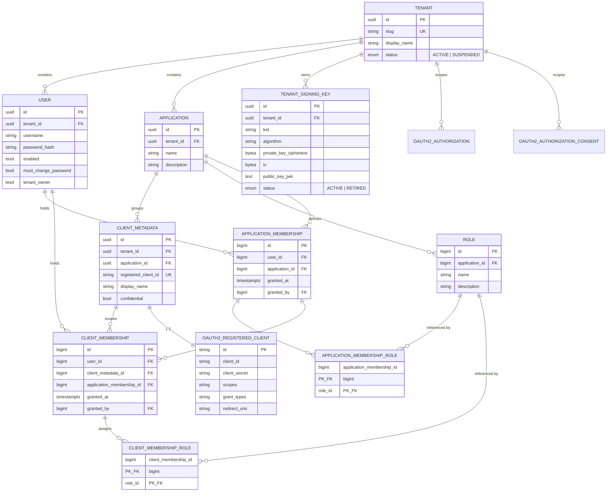
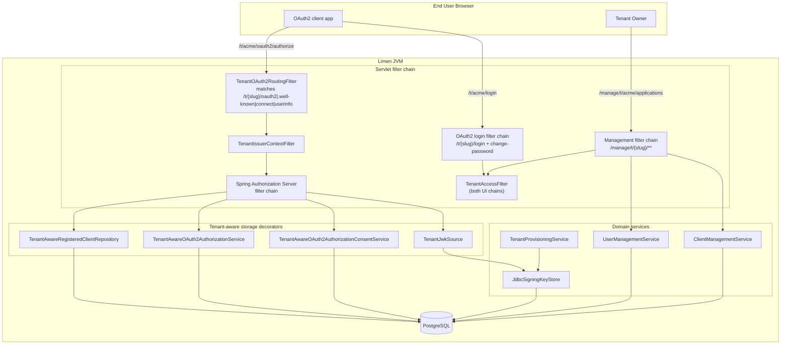
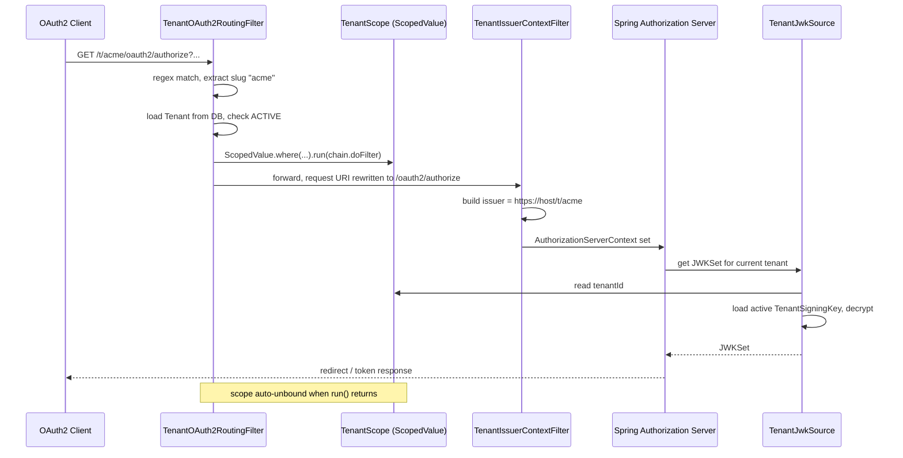
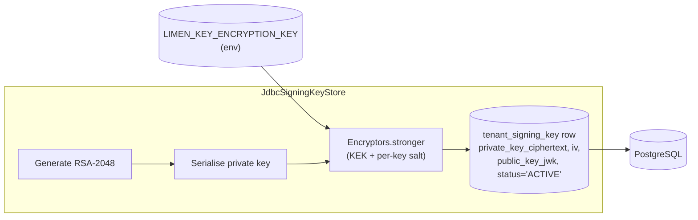
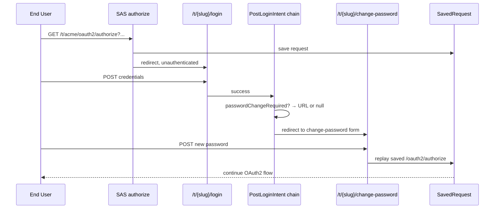
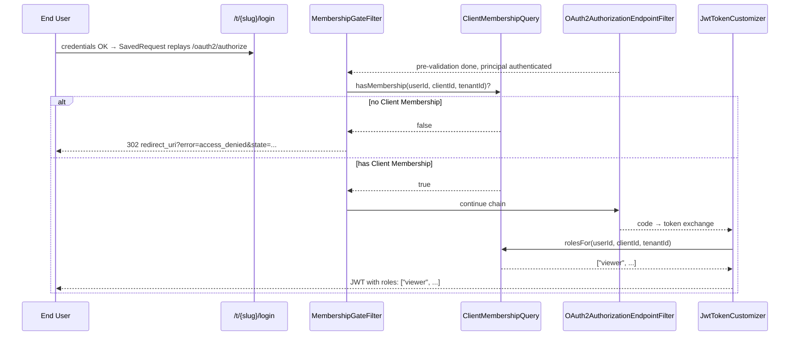

# Limen — Architecture

> A companion to `ubiquitous-language.md`. That file defines *what we call things*; this file describes *how the system is built*.

## 1. Purpose

Limen is a **multi-tenant OAuth2 / OIDC Authorization Server** built on top of Spring Authorization Server (SAS). It is a SaaS-style product: a single deployment hosts many independent **Tenants**, each with its own User pool, Applications, Clients, signing keys, and issuer URL.

The product is aimed at developers and organisations who need a hosted identity provider for their own applications without standing up Keycloak or paying for a commercial IdP. A new Tenant is created via public self-service signup; from that point on, the Tenant Owner manages everything for their Tenant through the management console at `/manage/t/{slug}/`.

Concretely, Limen provides:

- **Per-tenant OIDC issuer** at `https://{host}/t/{slug}/` with its own `.well-known/openid-configuration`, JWKS, authorization, token, introspection, revocation and userinfo endpoints.
- **Per-tenant signing keys** (RS256, RSA-2048), stored encrypted at rest using a single Key Encryption Key (KEK) supplied via environment variable.
- **Tenant-scoped storage** for all SAS persistence interfaces (`RegisteredClientRepository`, `OAuth2AuthorizationService`, `OAuth2AuthorizationConsentService`).
- **A management console** (Thymeleaf + REST) for managing Applications, Clients, Users, Roles, and Memberships.
- **A System Tenant** at the slug `system` for cross-tenant operations performed by System Admins.

## 2. Stack

| Layer | Choice |
|---|---|
| Language | Java 26 |
| Concurrency | Java virtual threads (`spring.threads.virtual.enabled=true`); per-request tenant binding via `ScopedValue` (`TenantScope`) |
| Framework | Spring Boot 4.0.5 |
| OAuth2 / OIDC | Spring Authorization Server (via `spring-boot-starter-security-oauth2-authorization-server`) |
| Persistence | Spring Data JDBC (records, no JPA / Hibernate) |
| Database | PostgreSQL |
| Schema migrations | Flyway |
| Web UI | Thymeleaf |
| Crypto | Spring Security Crypto (`Encryptors.stronger`), Nimbus JOSE+JWT |
| Tests | Spring Boot Test + Testcontainers (Postgres) |
| Build | Maven |
| Static analysis | Error Prone (compile-time bug detection); NullAway in `ERROR` mode (JSpecify, production code only — disabled on test compile); PMD report-only (complexity rules in `pmd-ruleset.xml`); JaCoCo coverage; Maven JXR for source cross-references |
| CI | GitHub Actions: a single `verify` job on push and PR to `main` runs `./mvnw -B -ntp verify` (compile + Error Prone + NullAway + Testcontainers tests + JaCoCo + PMD report). PMD HTML/XML + JXR uploaded as a 30-day artifact; JaCoCo HTML uploaded on failure |

## 3. Domain Model

The canonical definitions live in `ubiquitous-language.md`. The diagram below shows how those concepts map to persisted entities as of v2.



A few things worth calling out:

- **`User.username` is unique within a Tenant**, not globally. The same username can exist in multiple Tenants.
- **`client_metadata` joins to `oauth2_registered_client` 1:1** via a UNIQUE foreign key. The SAS table holds the OAuth2-wire fields (client id/secret, grant types, redirect URIs); `client_metadata` holds Limen-specific fields (display name, owning Application, owning Tenant). This split keeps Limen's tenant model from leaking into Spring's schema.
- **`tenant_signing_key` enforces "at most one ACTIVE key per Tenant"** with a partial unique index: `UNIQUE(tenant_id) WHERE status = 'ACTIVE'`. This is the enforcement point for key rotation.
- **`role` is per-Application.** The same row can be assigned as either an App Role (via `application_membership_role`) or a Client Role (via `client_membership_role`). `ON DELETE RESTRICT` from both join tables means you cannot delete a Role that is still in use — admin must unassign first.
- **`client_membership` has a hard FK + `ON DELETE CASCADE` to `application_membership`.** Application Membership is the eligibility gate; revoking it cascades the Client Memberships, matching the UL invariant.
- **Tenant isolation is transitive for the new tables.** `application_membership.application_id → applications.tenant_id` and `client_membership.client_metadata_id → client_metadata.tenant_id` both carry the boundary; the membership tables themselves do not need a `tenant_id` column. The service-layer queries (`UserMembershipPortfolioQuery`, `ClientMembershipQuery`) still apply an explicit `tenant_id` predicate as defence in depth, matching the existing decorator pattern.
- **`granted_by` is `ON DELETE SET NULL`** so deleting a granter does not cascade-revoke their grants. `granted_at` + `granted_by` form a minimal forensic trail until the audit log lands in v2.5.

## 4. Architecture Overview

### 4.1 Component layout



There are effectively **two HTTP surfaces** sharing one process:

1. **The OAuth2 / OIDC surface** under `/t/{slug}/...`, served by Spring Authorization Server using tenant-aware decorators over its JDBC-backed storage.
2. **The management console** under `/manage/t/{slug}/...` and `/signup`, served by ordinary Spring MVC controllers and a separate filter chain.

These surfaces use the same `users` table for authentication but different filter chains and entry points.

### 4.2 Request routing for OAuth2 traffic



The three crucial properties:

- **The tenant is resolved before SAS sees the request** — by the time Spring's filter chain runs, the URI no longer contains `/t/{slug}/` and `TenantScope` already holds the resolved tenant. This is what lets us reuse SAS unmodified.
- **The carrier is `ScopedValue`, not `ThreadLocal`.** The routing filter wraps `chain.doFilter(...)` in `ScopedValue.where(...).run(...)`; the binding is unwound automatically when `run()` returns, with no try/finally and no carrier-thread pinning under virtual threads. Seven SAS-coupled readers (`OAuth2AuthorizationService`, `OAuth2AuthorizationConsentService`, `RegisteredClientRepository`, `JWKSource`, `JwtTokenCustomizer`, the issuer-context filter, the entry point) read the scope on demand.
- **The JWKSource resolves the tenant on demand** rather than being pre-bound at bean construction, which is necessary because there is one shared SAS bean graph but many tenants.

The login path does **not** go through `TenantOAuth2RoutingFilter` (its regex matches only `oauth2|.well-known|connect|userinfo`). `/t/{slug}/login` is handled directly by the OAuth2 login filter chain (§4.5) and the slug rides on the `TenantAuthToken`, not the scope.

### 4.3 OAuth2 storage decorators

All three SAS storage interfaces are wrapped with a tenant-aware decorator. Two of them (`RegisteredClientRepository`, `OAuth2AuthorizationService`) use a *delegate-then-update* pattern: they call into the standard `JdbcXxx` implementation and then run a follow-up `UPDATE ... SET tenant_id = ?`. The third (`OAuth2AuthorizationConsentService`) writes its own SQL directly because the schema requires `tenant_id` to be part of the composite primary key, which makes the delegate-then-update approach unworkable.

The decorators all *read* by adding a `tenant_id = ?` predicate. A query that returns no row for the current Tenant looks identical to a row that does not exist, so cross-tenant lookups are invisible to the caller.

### 4.4 Signing keys



Properties:

- **One Key Encryption Key for the deployment**, supplied via `LIMEN_KEY_ENCRYPTION_KEY` (base64-encoded). Compromise of the database alone does not yield usable signing keys; compromise of the JVM process plus the database does.
- **Per-key random salt** stored in the `iv` column. The column is named `iv` for historical reasons; it is the salt passed to `Encryptors.stronger`, not an AES IV.
- **Public key stored as a JWK in plaintext** (`public_key_jwk`) so that the JWKS endpoint can be served without decrypting anything.
- **Keys are created during Tenant provisioning** by `TenantProvisioningService` calling `SigningKeyStore.createForTenant(tenantId)`. The System Tenant does not get a signing key — it never issues tokens.
- **Rotation is supported by the schema but not yet automated.** The `status` column (`ACTIVE` / `RETIRED`) plus the partial unique index allows multiple keys per Tenant with one ACTIVE; no scheduled job currently performs rotation.

### 4.5 Authentication flows

There are two tenant-scoped login surfaces — an OAuth2 end-user login at `/t/{slug}/login` and a management-console login at `/manage/t/{slug}/login` — plus a forced-password-change overlay that fires on both. They share one auth backend and one login pipeline.

**Unified tenant-aware backend.** Both login URLs go through the same `TenantAuthProvider` (in `com.stucray.limen.auth`), against a `TenantAuthToken` whose slug is captured from the URL path before authentication runs. The provider loads the User by `(tenant_id, username)` and returns a `TenantUserDetails` whose `tenantSlug()`/`tenantId()` are used downstream. There is no silent fallback to the System Tenant — a missing-or-mismatched slug fails the request loudly.

**One login deep module, two surfaces.** Form-filter wiring, success dispatch, remember-me, and cross-tenant defence all live in one immutable bean — `TenantLogin` (in `com.stucray.limen.auth.login`). Each surface is described by a `TenantUrlScheme` record (login pattern + slug regex + login/home/change-password URL templates); two scheme beans are registered out of the box (`oauth2UrlScheme`, `managementUrlScheme`). Each security chain wires its surface in one line: `login.applyTo(http, scheme)`. The form-login filter itself is a private inner class parameterised by the scheme — there is no `AbstractTenantAuthFilter` hierarchy any more.

**Defence in depth.** A `TenantAccessFilter` runs in both UI chains (wired automatically by `applyTo`): any authenticated request whose URL slug differs from the principal's tenant slug is force-logged-out and redirected to the URL slug's login. The root `/` renders a public landing template; bare `/login` is a slug-aware forwarder (`?slug=X` → `/manage/t/X/login`, otherwise → `/`).

**Tenant-scoped remember-me.** `TenantPersistentTokenBasedRememberMeServices` encodes the slug as a third segment in the cookie value (`series:token:slug`) and rejects mismatched slugs at decode. Storage is keyed by `(tenant_id, series)` via `TenantPersistentTokenRepository`. Both filter chains share the same repository bean.

**Post-login dispatch.** The old hard-coded success handler is replaced by an ordered chain of `PostLoginIntent` beans. Each intent inspects the just-authenticated principal and returns either a redirect URL or `null` (fall through). The default chain (in `PostLoginIntents`, terminal-last) is:

1. `passwordChangeRequired()` — redirects to the surface's change-password URL when `must_change_password` is set.
2. `resumeOAuth2Authorize()` — replays a saved `/oauth2/authorize` request, tenant-prefixing the URL under `/t/{slug}/`.
3. `tenantHome()` — terminal default: redirect to the surface's home.

Order matters: the password-change check fires **before** OAuth2-resume so a User with an expired password cannot complete an authorize flow before updating it. New policies are added by registering an `@Bean PostLoginIntent` with an `@Order` value; user-supplied intents are prepended to the defaults via `ObjectProvider#orderedStream()`.

**Forced password change.** Two trigger paths share one orchestrator. On a fresh login, the `passwordChangeRequired()` intent (above) catches a User whose `must_change_password` flag is set and redirects them to the surface's change-password URL. Inside the management console — for example, after an admin clicks **Reset password** mid-session — `PasswordChangeRequiredInterceptor` (in `management.users`) catches subsequent requests and does the same redirect. Both change-password controllers (`oauth2.EndUserPasswordChangeController` and `management.users.PasswordChangeController`) delegate to a shared `TenantPasswordChangeFlow` (in `auth.login`) for validation, persistence, and OAuth2-authorize-resume. The resume target is always tenant-prefixed under `/t/{slug}/oauth2/authorize` regardless of which surface the User changed their password on, because the authorize endpoint only lives on the OAuth2 surface.



### 4.6 Authorization — Roles, Memberships, and the JWT `roles` claim

v1 left the `roles` JWT claim hardcoded to `[]`. v2 replaces that with a query against the new Membership tables and adds an explicit gate at `/oauth2/authorize` that rejects authenticated Users without a Client Membership.

**The two planes.** Roles are defined per Application in the `role` table. The same Role row can be attached as either an **App Role** (via `application_membership_role`) or a **Client Role** (via `client_membership_role`). App Roles govern management-console authority over the Application; they never appear in JWTs. Client Roles are what the resource server reads from the `roles` claim.

**JWT emission rule.** `SasConfig.jwtTokenCustomizer()` calls `ClientMembershipQuery.rolesFor(userId, registeredClientId, tenantId)`, which runs:

```sql
SELECT r.name
  FROM client_membership cm
  JOIN client_membership_role cmr ON cmr.client_membership_id = cm.id
  JOIN role r                     ON r.id = cmr.role_id
  JOIN client_metadata m          ON m.id = cm.client_metadata_id
 WHERE cm.user_id = ?
   AND m.registered_client_id = ?
   AND m.tenant_id = ?
 ORDER BY r.name;
```

The `tenant_id` predicate is redundant — the FK chain already enforces containment — but it is kept explicit as defence in depth, matching the `TenantAware*` decorator pattern. The customizer emits the resulting list as the `roles` claim alongside the existing `tenant` claim. A Client Membership with zero Roles emits `roles: []`; that is a valid, working state, just one without specific authority.

**`/oauth2/authorize` Membership gate.** A `MembershipGateFilter` sits inside the SAS security chain after the SAS pre-validation filter and before `OAuth2AuthorizationEndpointFilter`. It runs only when the request matches `/oauth2/authorize`, the principal is an authenticated `TenantUserDetails`, and the `client_id` parameter resolves to a known `RegisteredClient`. If `ClientMembershipQuery.hasMembership(...)` returns `false`, the filter writes a redirect back to the Client's `redirect_uri` with `error=access_denied` and the original `state`, per RFC 6749 §4.1.2.1.

End-User Login at `/t/{slug}/login` is unchanged. Credentials are still checked against the Tenant's User pool the same way; the Membership gate sits one step downstream so authentication and authorization remain separable failure modes.



**Implementation note — why a Filter, not an AuthenticationProvider.** The PRD originally proposed an `AuthenticationProvider` decorator on `OAuth2AuthorizationCodeRequestAuthenticationProvider`. SAS 7's configurer captures the validator composite via reflection on an `instanceof` check after `authenticationProviders(consumer)` runs: wrapping or replacing the original provider breaks `OAuth2AuthorizationCodeRequestValidatingFilter` construction (`Assert.notNull(authenticationValidator)`); inserting alongside lets `ProviderManager` catch the gate's `AuthenticationException` and fall through to the original provider, which then issues a code anyway. A pre-endpoint filter has none of those failure modes. The full reasoning lives in the `MembershipGateFilter` class comment.

**Read paths into Memberships.** Two narrow, JdbcTemplate-backed query modules sit alongside the CRUD services:

| Module | Reader | Purpose |
|---|---|---|
| `ClientMembershipQuery` | `JwtTokenCustomizer`, `MembershipGateFilter` | Per-(user, client, tenant) Roles list + presence check on the request hot path |
| `UserMembershipPortfolioQuery` | User detail screen | Per-(user, tenant) full portfolio: every App Membership with App Roles, nested with Client Memberships and Client Roles |

Both apply the explicit `tenant_id` predicate. `UserMembershipPortfolioQuery` issues two SELECTs (one per membership table) and assembles in Java rather than COALESCE-ing in SQL — the assembly is cheaper to read than a six-way join.

**UI surface.** Per-Application primary, per-User read-only:

| Route | Purpose |
|---|---|
| `/manage/t/{slug}/applications/{appId}/roles/**` | Role catalogue CRUD |
| `/manage/t/{slug}/applications/{appId}/members/**` | Application Membership grant / Role assign / revoke |
| `/manage/t/{slug}/applications/{appId}/clients/{clientId}/members/**` | Client Membership grant / Role assign / revoke (gated on existing App Membership) |
| `/manage/t/{slug}/users/{userId}` | Read-only Membership portfolio for the User; rows link back to the per-Application / per-Client editing screens |

There is intentionally no second write path on the User detail page — all editing happens from the Application screens.

### 4.7 Database schema

| Migration | Purpose |
|---|---|
| `V1__initial_schema.sql` | All baseline tables (`tenants`, `users`, `persistent_logins`, `applications`, `oauth2_registered_client`, `oauth2_authorization`, `oauth2_authorization_consent`, `client_metadata`, `tenant_signing_key`) and their indexes, including the partial unique "one ACTIVE signing key per tenant" index |
| `V2__add_tenant_to_persistent_logins.sql` | Adds `tenant_id` to `persistent_logins`, swaps the primary key to `(tenant_id, series)`, and indexes `(tenant_id, username)`. `TRUNCATE`s existing rows — the conservative response to a tenant-isolation gap, since the old two-segment cookie format cannot represent the tenant either |
| `V3__role_catalogue.sql` | Adds the per-Application `role` table (`UNIQUE(application_id, name)`). Discrete rows replace freeform strings: typo-proof assignment, safe renames, room for future metadata, and a natural surface for the "Manage Roles" screen. `ON DELETE CASCADE` from `applications`; the role-assignment join tables in V4/V5 reference `role` with `ON DELETE RESTRICT` so an in-use Role cannot be silently removed |
| `V4__application_membership.sql` | Adds `application_membership` (`UNIQUE(user_id, application_id)`) and `application_membership_role`. App Memberships govern management-console authority over the Application; their Roles never travel in JWTs |
| `V5__client_membership.sql` | Adds `client_membership` (`UNIQUE(user_id, client_metadata_id)`) and `client_membership_role`. Hard FK + `ON DELETE CASCADE` from `client_membership.application_membership_id` to `application_membership(id)` enforces the eligibility-gate semantic at the schema level: revoking an App Membership cascades the Client Memberships under it. The cross-table invariant (Client Membership's App Membership must reference the same Application as the Client Membership's Client) is enforced in the service layer rather than via a DB trigger |

Future migrations must be **additive** (`ALTER TABLE ADD COLUMN ... NULL` → backfill → `ALTER ... NOT NULL`) — never `DROP TABLE` on the tenant-scoped OAuth2 tables, since they will hold live grants and consents.

### 4.8 HTTP route map

| Surface | Pattern | Notes |
|---|---|---|
| Public | `GET /` | Public landing page (sign-in by slug, sign-up CTA) |
| Public | `GET /login` | Slug-aware forwarder: `?slug=X` → `/manage/t/X/login`; otherwise → `/`. There is no bare `POST /login` — every login submission is tenant-scoped under `/t/{slug}/login` or `/manage/t/{slug}/login` |
| Public | `GET /signup`, `POST /signup` | Self-service Tenant creation |
| OAuth2 | `GET /t/{slug}/.well-known/openid-configuration` | Per-tenant discovery |
| OAuth2 | `GET /t/{slug}/.well-known/jwks.json` | Per-tenant JWKS |
| OAuth2 | `GET /t/{slug}/oauth2/authorize` | Authorization endpoint |
| OAuth2 | `POST /t/{slug}/oauth2/token` | Token endpoint |
| OAuth2 | `POST /t/{slug}/oauth2/introspect`, `POST /t/{slug}/oauth2/revoke` | Introspection and revocation |
| OAuth2 | `GET /t/{slug}/userinfo` | OIDC UserInfo |
| OAuth2 | `GET /t/{slug}/login`, `POST /t/{slug}/login` | End-User Login |
| OAuth2 | `GET /t/{slug}/change-password`, `POST /t/{slug}/change-password` | End-user forced password change, with SavedRequest resume |
| Management | `GET /manage/t/{slug}/login`, `POST /manage/t/{slug}/login` | Tenant Owner / System Admin login |
| Management | `GET /manage/t/{slug}/` | Dashboard |
| Management | `GET /manage/t/{slug}/settings`, `POST /manage/t/{slug}/settings/display-name` | Tenant Owner edits Display Name |
| Management | `/manage/t/{slug}/applications/**` | Application CRUD |
| Management | `/manage/t/{slug}/applications/{appId}/roles/**` | Role catalogue CRUD |
| Management | `/manage/t/{slug}/applications/{appId}/members/**` | Application Membership + App Role assignment |
| Management | `/manage/t/{slug}/applications/{appId}/clients/**` | Client CRUD; `POST .../clients/{registeredClientId}/rotate-secret` rotates the secret |
| Management | `/manage/t/{slug}/applications/{appId}/clients/{registeredClientId}/members/**` | Client Membership + Client Role assignment |
| Management | `/manage/t/{slug}/users/**` | User CRUD plus per-User actions: `enable`, `disable`, `reset-password`, `grant-owner`, `revoke-owner`, `delete`. `GET /users/{userId}` shows the User's read-only Membership portfolio |
| Management | `/manage/t/{slug}/change-password` | In-console forced password change |
| System | `/manage/system/tenants`, `POST /manage/system/tenants/{tenantId}/{suspend\|unsuspend\|delete}` | System Admin cross-tenant operations. System Admins log in via the standard management surface at `/manage/t/system/login` (the System Tenant slug is `system`) |

### 4.9 Tests

The suite is integration-heavy and runs against real Postgres via Testcontainers. The OAuth2 storage decorators each have a tenant-isolation contract test that proves a row written under Tenant A is invisible to Tenant B. The end-to-end OAuth2 flow has an integration test that exercises the full per-tenant issuer / JWKS / authorize / token chain. The v2 Membership work added an end-to-end test that drives the full Membership-to-JWT path (`OAuth2JwtRolesClaimIntegrationTest`) and a gate test that asserts `access_denied` for an authenticated User without a Client Membership (`OAuth2AuthorizeMembershipGateIntegrationTest`). Cross-tenant isolation is pinned by explicit tests on both the login backend (`CrossTenantLoginIsolationIntegrationTest`) and the System Admin console (`SystemAdminCrossTenantIsolationIntegrationTest`).

The login deep module (`auth.login`) is exercised by both unit tests (`TenantLoginUnitTest`, `PostLoginIntentsUnitTest`, `TenantUrlSchemeUnitTest`) and a synthetic-scheme integration test that registers a third `TenantUrlScheme` to prove `applyTo` is surface-agnostic.

There is currently no separation between unit and integration tests — the fast path is `mvn test`, which boots Testcontainers for everything. Test method names follow `@DisplayName` conventions established in PR #75.

### 4.10 Static analysis & CI

Static analysis runs in two postures:

- **Blocking, on every compile.** Error Prone runs as a `javac` plugin (`-Xplugin:ErrorProne`) and fails the build on any of its checks. NullAway runs as an Error Prone check elevated to `ERROR` severity, in JSpecify mode, on the annotated package `com.stucray.limen`. NullAway is **disabled on the test compile** (`-Xep:NullAway:OFF`) — tests construct fixtures with the `new Entity(null, ...)` Spring Data convention and the noise was not buying meaningful safety. The Spring `@Autowired` and Mockito `@Mock`/`@InjectMocks` annotations are also excluded from NullAway's "uninitialised field" check.
- **Report-only, on `verify`.** PMD runs against `pmd-ruleset.xml` (a complexity-only ruleset: cognitive / cyclomatic / NPath complexity, NCSS, parameter list, God class, too-many-fields/methods/public). The build does **not** fail on PMD findings — the report is uploaded as a CI artifact (`pmd.xml`, `pmd.html`, JXR cross-reference) for review. JaCoCo measures coverage during the same `verify` phase and its HTML report is uploaded only on failure.

CI is a single GitHub Actions workflow (`.github/workflows/ci.yml`) with one `verify` job on push and PR to `main`. The job sets up JDK 26 (Temurin, with Maven cache), runs `./mvnw -B -ntp verify`, and uploads the PMD bundle (30-day retention) and — on failure — the JaCoCo HTML report (14-day retention). The `LIMEN_SECURITY_KEK` is supplied as a GitHub Actions secret.

## 5. Current Gaps and Shortcomings

These are known limitations of the current surface. None of them block the product working; all of them are fair targets for follow-up work. Items marked **→ PRD #120** are closed by the production-credibility PRD currently in progress (see §6 v3).

### Authentication and identity

- **No MFA, no WebAuthn, no social login.** The PRD scoped v1 to username + password.
- **→ PRD #120 — No email capability.** Forced password change exists, but there is no password-reset-via-email flow, no signup confirmation, and no notification on suspicious login. Tenant Owners must hand out temporary passwords out-of-band.
- **→ PRD #120 — No account lockout or brute-force protection** on either the management login or the end-user login.
- **No session management UI.** Users cannot list or revoke their active sessions, and Tenant Owners cannot terminate a User's sessions.

### Operational concerns

- **→ PRD #120 — No rate limiting** on `/oauth2/token`, `/oauth2/authorize`, `/login`, or `/signup`. A single attacker can hammer the token endpoint or sign up reserved-looking slugs without friction.
- **→ PRD #120 — No audit log.** Login attempts (success or failure), token issuance, client secret rotation, and Tenant lifecycle events are not recorded.
- **No metrics / observability.** Spring Boot Actuator is on the classpath but no Micrometer dashboards or counters are wired beyond defaults.
- **No signing-key rotation job.** The schema supports it; nothing schedules it.
- **No consent revocation UI.** Consents are persisted per Tenant but end-users have no way to view or revoke them; only direct DB or admin action would clear them.

### Code-level

- **No CSRF / origin checks on Client redirect URIs** beyond what Spring's `RegisteredClient` already enforces. The management UI does not validate that user-supplied redirect URIs use HTTPS, are not localhost, or are not open redirectors.
- **→ PRD #120 — System Admin console is partial.** Suspend / unsuspend / delete endpoints exist; the surrounding Thymeleaf UI is thin compared to the Tenant Owner console — notably, there is no UI for *creating* a Tenant outside the public `/signup` path.

### Schema and data model

- **`oauth2_registered_client` is a global SAS table.** Tenant scoping is enforced by the `client_metadata` join and by the tenant-aware decorators; nothing in the SAS table itself prevents a stray query from returning cross-tenant rows. The decorators are the only defence.

## 6. Roadmap

Roughly grouped by horizon. None of these are committed to dates.

### ~~v2 — close the authorization hole~~ (shipped 2026-04-28)

1. ~~**Roles, Memberships, Scopes** — the v1 PRD explicitly deferred these.~~ Shipped: per-Application `role` catalogue, split `application_membership` / `client_membership` tables with role-join tables, real `roles` JWT claim from Client Memberships, `/oauth2/authorize` Membership gate. Scopes intentionally untouched (still on `oauth2_registered_client.scopes`); see §4.6 for the wiring. PRD #39, slices #40–#46.
2. ~~**Application + Client membership UI** in the Tenant Owner console.~~ Shipped: per-Application Members and Roles screens, per-Client Members screen, read-only Membership portfolio on the User detail page (rows link back to the Application screens for editing).

### v3 — production credibility (PRD #120, in progress)

A single PRD covering five gaps that block Limen being credible as a hosted IdP. Eight tracer-bullet slices; sequencing in the PRD.

3. **Email-as-identity.** Drops `username` in favour of `email` with `UNIQUE(tenant_id, email)`. The per-tenant uniqueness scope preserves the user-pool-per-Tenant model (Auth0 / AWS Cognito shape) — the same email can identify two distinct Users in two different Tenants. Existing dev data is dropped at migration time; there are no real customers yet.
4. **`EmailSender` infrastructure.** Provider-agnostic interface with two implementations: `LoggingEmailSender` (default and dev profile, writes message to slf4j — click the magic link from the log) and `SmtpEmailSender` (test profile, wired to a Mailpit Testcontainer; later, production profile pointing at a real SMTP host). No real provider in this PRD — that's a deferred config swap (see v4).
5. **Audit log — event-driven.** A new `audit_event` Postgres table written by **event listeners**, not by direct service calls. Spring's existing `AuthenticationSuccessEvent` / `AuthenticationFailureEvent` are subscribed natively; small `record`-based custom event types cover OTT lifecycle, Tenant lifecycle, secret rotation, password change, rate-limit hits. Listeners use `@TransactionalEventListener(phase = AFTER_COMMIT)` so a failed audit write never rolls back the user-facing action. Loose coupling: code paths that perform actions never name `AuditService` — they `applicationEventPublisher.publishEvent(...)` and the audit module decides whether to listen. Future consumers (metrics, webhooks, SIEM forwarders) add listeners without touching emit sites. No admin UI in v3 — the schema is designed so the UI is a pure-additive follow-up (see v3.5). Best-effort delivery for now: a JVM crash between transaction commit and listener execution loses that event; at-least-once is the Modulith adoption story below.
6. **Email verification + self-service password reset.** Both built on Spring Security 7's One-Time Token Login (`OneTimeTokenService`, `oneTimeTokenLogin()` DSL, `JdbcOneTimeTokenService`) — one OTT primitive serves both flows, distinguished by an `intent` column on the OTT row. A `TenantAwareOneTimeTokenService` decorator mirrors the existing `TenantAware*` storage decorators (§4.3): tokens generated under Tenant A are invisible / unusable from Tenant B. A custom `OneTimeTokenGenerationSuccessHandler` calls into `EmailSender` to deliver the magic link. Verification is required before first login. Password-reset OTT consumption drops the User into the existing `TenantPasswordChangeFlow` (§4.5) for forced change.
7. **Account lockout.** A new event listener subscribes to `AuthenticationFailureEvent` and `AuthenticationSuccessEvent`, increments / resets `failed_login_attempts` on `users`, and sets `locked_until` when a threshold is reached. A pre-authentication check rejects logins for locked users with an explicit "account locked" message rather than "wrong password". Tenant-admin unlock UI on the User detail page closes the loop.
8. **Rate limiting.** Bucket4j in-memory, single-process. A high-precedence `RateLimitFilter` is configured per-endpoint with key extractors (per-IP, per-client, per-email as appropriate) and returns 429 + `Retry-After` when a bucket is dry. State is per-process — fine for the current single-container deployment; Postgres-backed Bucket4j is a deferred swap (see v3.5) for when horizontal scaling matters.
9. **System-admin tenant-create UI.** Exposes the existing `TenantProvisioningService` via `/manage/system/tenants/new`. A new `TenantUserBootstrap` wraps Tenant creation + Owner User insert + verification-OTT send into one atomic operation, reused both by the new system-admin form and by the public `/signup` path so both bootstrap flows stay consistent.

### v3.5 — operational hardening (post-PRD-#120)

10. **Spring Modulith adoption.** Formalises the existing package boundaries (`auth`, `oauth2`, `management`, `tenant`, etc.) as application modules with explicit cross-module dependency rules. Brings two concrete wins: `@ApplicationModuleListener` (async + transactional event handling out of the box) and the `event_publication` registry, which **closes the at-least-once delivery gap** in the v3 audit design (events are persisted in the publication registry before listener execution and replayed on restart if the listener fails). Module boundaries are also verifiable by Modulith's built-in ArchUnit-style tests, replacing convention-based discipline with compile-time enforcement. Migration cost: map current packages to modules, decide cross-module dependency policy, add the publication registry table via Flyway. **Audit-side change at adoption time is a single annotation swap (`@TransactionalEventListener` → `@ApplicationModuleListener`); emit sites are unchanged.** The forward-compatibility was the design driver behind choosing event-driven audit in v3.
11. **Audit admin UI.** List + filter views under `/manage/t/{slug}/audit` (Tenant-scoped) and `/manage/system/audit` (cross-tenant). CSV export. Pure-additive on top of the v3 schema.
12. **Metrics.** Micrometer counters for login success / failure, token issuance, key rotation; latency histograms on the token endpoint.
13. **Signing-key rotation job.** Scheduled, with overlap window so old tokens validate against the retired key during a grace period.
14. **Postgres-backed rate-limit state.** Swap Bucket4j in-memory for `bucket4j-postgresql` when horizontal scaling matters. The v3 `RateLimitFilter` interface is designed to accept either backend.

### v4 — identity surface

15. **MFA** — TOTP first, WebAuthn / passkeys after. Spring Security 7 ships `@EnableMultiFactorAuthentication` as a starting point.
16. **Session management UI** — for end-users (revoke my own sessions and consents) and for Tenant Owners (revoke a User's sessions).
17. **Consent / OAuth2 scope revocation UI.** `OAuth2AuthorizationConsent` rows persist today but are invisible to end-users.
18. **Real email provider wiring.** Resend / Brevo / SendGrid / SES / etc. — a one-slice config swap on top of the v3 `EmailSender` abstraction.

### v4+ — platform

19. **Federation / social login** as Tenant-configurable identity providers.
20. **Per-Tenant branding** (login page logo, colour scheme, custom domain).
21. **Per-Tenant custom claims** in JWTs.
22. **Hardware-backed KEK** (KMS / HSM) instead of the env-var KEK, with envelope encryption per signing key.
