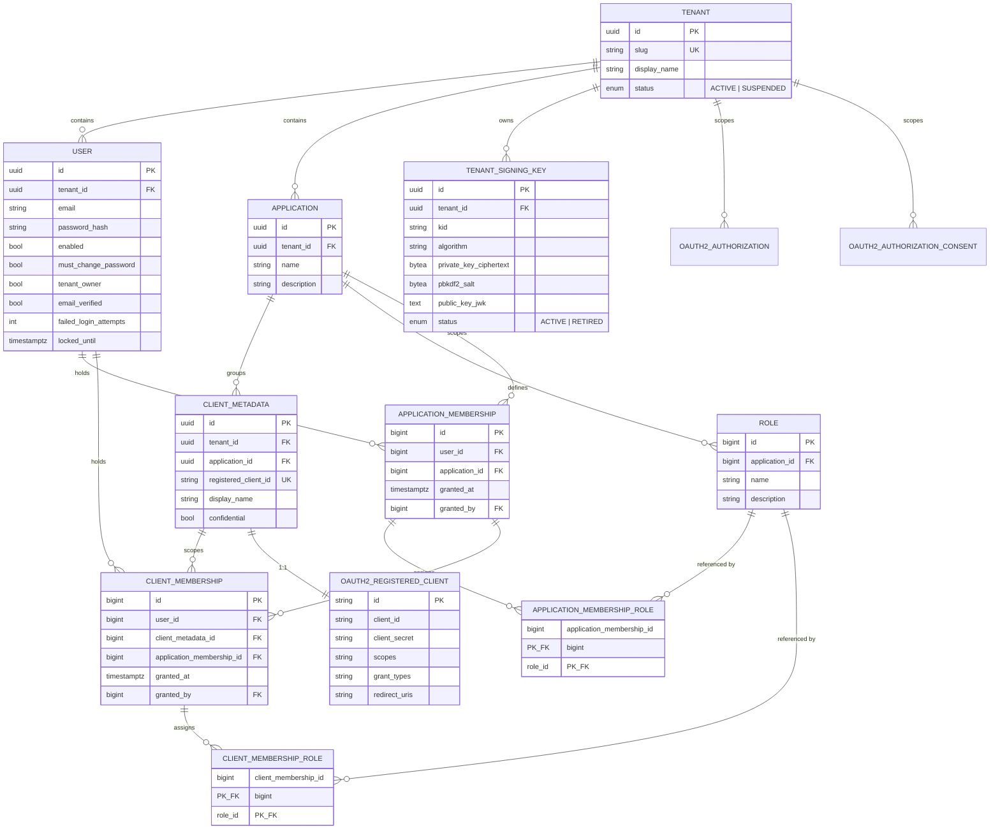
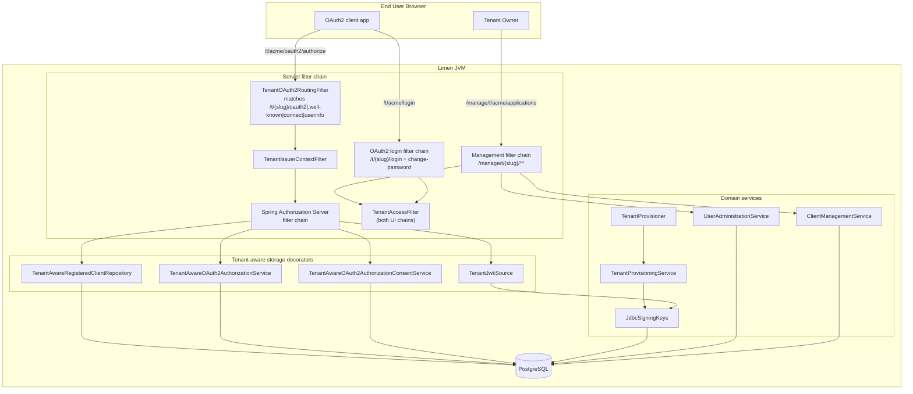
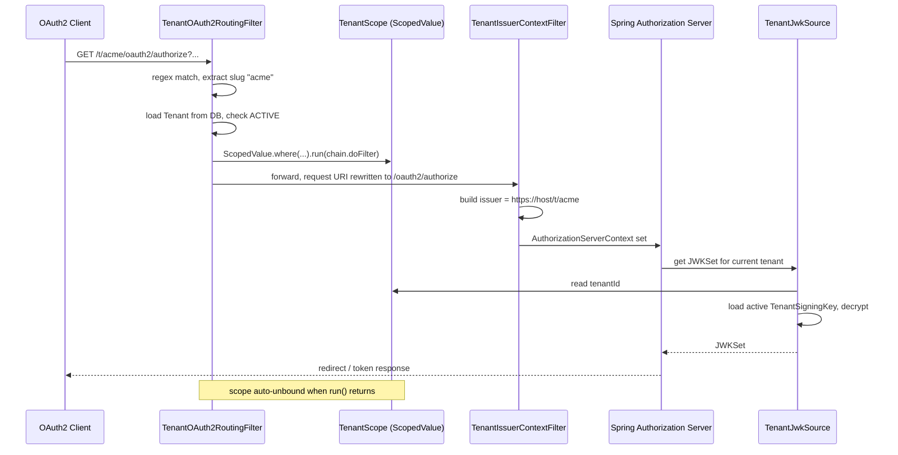
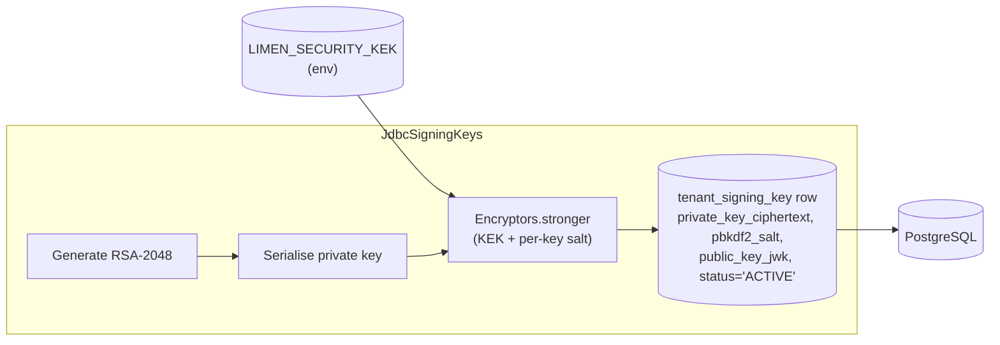
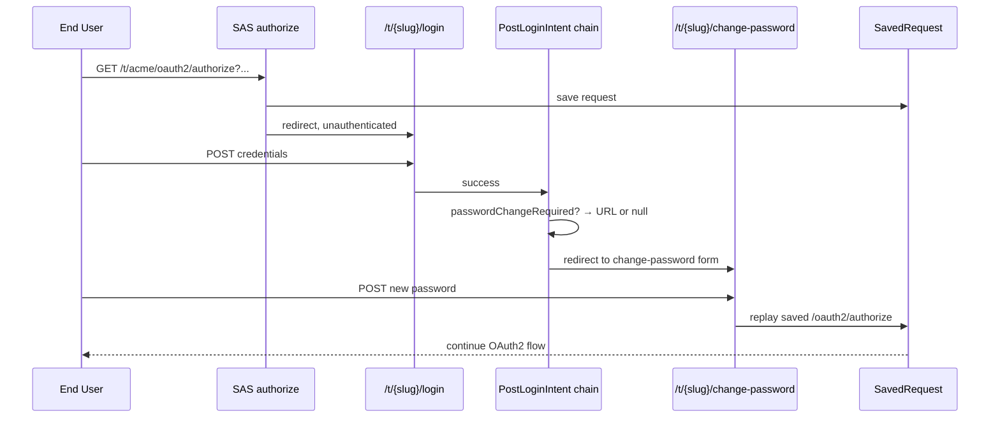
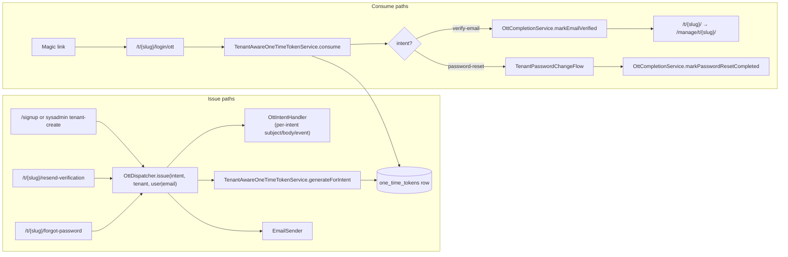
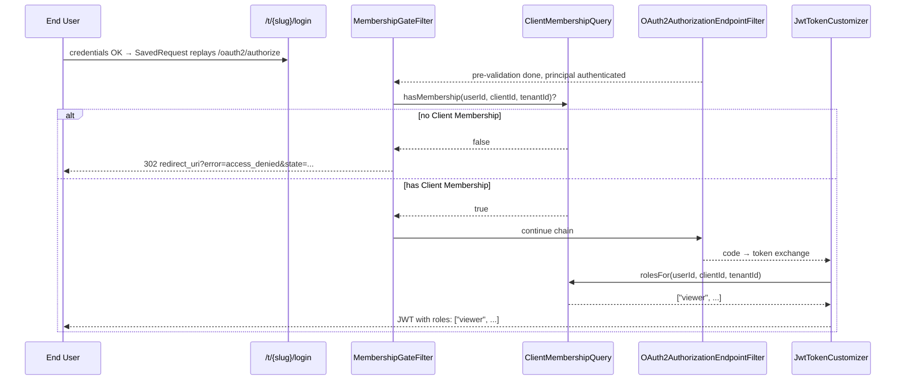

# Limen — Architecture

> A companion to `ubiquitous-language.md`. That file defines *what we call things*; this file describes *how the system is built*.

> **Heading convention.** Section headings are plain prose — no markdown decoration (backticks, bold, links) and no clarifying parentheticals; put those in the section body. `package-info.java` files cite sections from this document as `§N.M (<heading text>)` and must match the heading byte-for-byte. `ArchitectureDocCitationTest` enforces this on every CI build.

## 1. Purpose

Limen is a **multi-tenant OAuth2 / OIDC Authorization Server** built on top of Spring Authorization Server (SAS). It is a SaaS-style product: a single deployment hosts many independent **Tenants**, each with its own User pool, Applications, Clients, signing keys, and issuer URL.

The product is aimed at developers and organisations who need a hosted identity provider for their own applications without standing up Keycloak or paying for a commercial IdP. A new Tenant is created via public self-service signup; from that point on, the Tenant Owner manages everything for their Tenant through the management console at `/manage/t/{slug}/`.

Concretely, Limen provides:

- **Per-tenant OIDC issuer** at `https://{host}/t/{slug}/` with its own `.well-known/openid-configuration`, JWKS, authorization, token, introspection, revocation and userinfo endpoints.
- **Per-tenant signing keys** (RS256, RSA-2048), stored encrypted at rest using a single Key Encryption Key (KEK) supplied via environment variable.
- **Tenant-scoped storage** for all SAS persistence interfaces (`RegisteredClientRepository`, `OAuth2AuthorizationService`, `OAuth2AuthorizationConsentService`).
- **A management console** (Thymeleaf + REST) for managing Applications, Clients, Users, Roles, and Memberships.
- **A System Tenant** at the slug `system` for cross-tenant operations performed by System Admins.

## 2. Stack

| Layer | Choice |
|---|---|
| Language | Java 26 |
| Concurrency | Java virtual threads (`spring.threads.virtual.enabled=true`); per-request tenant binding via `ScopedValue` (`TenantScope`) |
| Framework | Spring Boot 4.0.5 |
| OAuth2 / OIDC | Spring Authorization Server (via `spring-boot-starter-security-oauth2-authorization-server`) |
| Persistence | Spring Data JDBC (records, no JPA / Hibernate) |
| Database | PostgreSQL |
| Schema migrations | Flyway |
| Web UI | Thymeleaf |
| Crypto | Spring Security Crypto (`Encryptors.stronger`), Nimbus JOSE+JWT |
| Tests | Spring Boot Test + Testcontainers (Postgres) |
| Build | Maven |
| Static analysis | Error Prone (compile-time bug detection); NullAway in `ERROR` mode (JSpecify, production code only — disabled on test compile); PMD report-only (complexity rules in `pmd-ruleset.xml`); JaCoCo coverage; Maven JXR for source cross-references |
| CI | GitHub Actions: a single `verify` job on push and PR to `main` runs `./mvnw -B -ntp verify` (compile + Error Prone + NullAway + Testcontainers tests + JaCoCo + PMD report). PMD HTML/XML + JXR uploaded as a 30-day artifact; JaCoCo HTML uploaded on failure |
| Container image | Paketo buildpacks via `spring-boot:build-image` (no Dockerfile); multi-arch `linux/amd64` + `linux/arm64`; published to `ghcr.io/stucray/limen` (private). See §4.16. |

## 3. Domain Model

The canonical definitions live in `ubiquitous-language.md`. The diagram below shows how those concepts map to persisted entities as of v2.



A few things worth calling out:

- **`User.email` is unique within a Tenant**, not globally — `UNIQUE(tenant_id, email)`. The same email can identify two distinct Users in two different Tenants (the user-pool-per-Tenant model used by Auth0 / AWS Cognito).
- **`email_verified`, `failed_login_attempts`, `locked_until` are operational columns** added by V8 / V9. `email_verified` gates first login (verification OTT must be consumed); the lockout pair is managed by `LoginAttemptTracker` and reset by an admin "Unlock account" action (see §4.9).
- **`client_metadata` joins to `oauth2_registered_client` 1:1** via a UNIQUE foreign key. The SAS table holds the OAuth2-wire fields (client id/secret, grant types, redirect URIs); `client_metadata` holds Limen-specific fields (display name, owning Application, owning Tenant). This split keeps Limen's tenant model from leaking into Spring's schema.
- **`tenant_signing_key` enforces "at most one ACTIVE key per Tenant"** with a partial unique index: `UNIQUE(tenant_id) WHERE status = 'ACTIVE'`. This is the enforcement point for key rotation.
- **`role` is per-Application.** The same row can be assigned as either an App Role (via `application_membership_role`) or a Client Role (via `client_membership_role`). `ON DELETE RESTRICT` from both join tables means you cannot delete a Role that is still in use — admin must unassign first.
- **`client_membership` has a hard FK + `ON DELETE CASCADE` to `application_membership`.** Application Membership is the eligibility gate; revoking it cascades the Client Memberships, matching the UL invariant.
- **Tenant isolation is transitive for the new tables.** `application_membership.application_id → applications.tenant_id` and `client_membership.client_metadata_id → client_metadata.tenant_id` both carry the boundary; the membership tables themselves do not need a `tenant_id` column. The service-layer queries (`UserMembershipPortfolioQuery`, `ClientMembershipQuery`) still apply an explicit `tenant_id` predicate as defence in depth, matching the existing decorator pattern.
- **`granted_by` is `ON DELETE SET NULL`** so deleting a granter does not cascade-revoke their grants. `granted_at` + `granted_by` form a minimal forensic trail until the audit log lands in v2.5.

## 4. Architecture Overview

### 4.1 Component layout



There are effectively **two HTTP surfaces** sharing one process:

1. **The OAuth2 / OIDC surface** under `/t/{slug}/...`, served by Spring Authorization Server using tenant-aware decorators over its JDBC-backed storage.
2. **The management console** under `/manage/t/{slug}/...` and `/signup`, served by ordinary Spring MVC controllers and a separate filter chain.

These surfaces use the same `users` table for authentication but different filter chains and entry points.

### 4.2 Request routing for OAuth2 traffic



The three crucial properties:

- **The tenant is resolved before SAS sees the request** — by the time Spring's filter chain runs, the URI no longer contains `/t/{slug}/` and `TenantScope` already holds the resolved tenant. This is what lets us reuse SAS unmodified.
- **The carrier is `ScopedValue`, not `ThreadLocal`.** The routing filter wraps `chain.doFilter(...)` in `ScopedValue.where(...).run(...)`; the binding is unwound automatically when `run()` returns, with no try/finally and no carrier-thread pinning under virtual threads. Seven SAS-coupled readers (`OAuth2AuthorizationService`, `OAuth2AuthorizationConsentService`, `RegisteredClientRepository`, `JWKSource`, `JwtTokenCustomizer`, the issuer-context filter, the entry point) read the scope on demand.
- **The JWKSource resolves the tenant on demand** rather than being pre-bound at bean construction, which is necessary because there is one shared SAS bean graph but many tenants.

The login path does **not** go through `TenantOAuth2RoutingFilter` (its regex matches only `oauth2|.well-known|connect|userinfo`). `/t/{slug}/login` is handled directly by the OAuth2 login filter chain (§4.5) and the slug rides on the `TenantAuthToken`, not the scope.

### 4.3 OAuth2 storage decorators

All three SAS storage interfaces are wrapped with a tenant-aware adapter, plus a tenant-aware `JWKSource`. They live in the internal sub-package `oauth2.sas` alongside their `@Configuration` (`SasConfig`); all four adapter classes are package-private — the rest of the application autowires the Spring SPI interface types published by `SasConfig`'s `@Bean` methods. Spring Modulith's default sub-package-internal rule is the boundary, locked in by `ApplicationModules.verify()`.

The four adapters are intentionally different shapes — each Spring SPI it implements forces it:

| Adapter | Shape |
|---|---|
| `TenantAwareRegisteredClientRepository` | Decorator over `JdbcRegisteredClientRepository`. **Allows null `TenantScope`** so the management console can read across tenants. |
| `TenantAwareOAuth2AuthorizationService` | *Delegate-then-`UPDATE`*: calls into the standard `JdbcOAuth2AuthorizationService` then runs a follow-up `UPDATE ... SET tenant_id = ?`. |
| `TenantAwareOAuth2AuthorizationConsentService` | Direct reimplementation — Spring's `INSERT` cannot supply `tenant_id`, which the composite PK requires. |
| `TenantJwkSource` | Direct `JWKSource<SecurityContext>` impl with two-mechanism tenant resolution (issuer URL parse → `TenantScope` fallback). |

Two of those four (Authorization and Consent services) share a one-line helper `SasTenantScope.requireTenantId(callerName)` that throws `IllegalStateException` when no scope is bound. The other two have *different* missing-scope semantics by design (RegisteredClient allows null, JwkSource runs the issuer-URL fallback first), so they don't call the shared helper. Which adapters call `SasTenantScope` is the load-bearing contract.

The adapters all *read* by adding a `tenant_id = ?` predicate. A query that returns no row for the current Tenant looks identical to a row that does not exist, so cross-tenant lookups are invisible to the caller. `TenantScopedSasIntegrationTest` pins the invariant across all four SPIs in one boundary test.

One more class lives in `oauth2.sas` alongside the adapters but is a different shape: `SasServerErrorTranslationFilter`. It's a servlet `Filter` registered at the head of the SAS `SecurityFilterChain` by `SasConfig`. It catches any uncaught `RuntimeException` thrown by downstream SAS endpoint filters and rewrites the response as `500 application/json {"error":"server_error", ...}` — the RFC 6749 §5.2 shape that RFC-compliant OAuth2 clients (including Spring Security's `OAuth2ErrorResponseErrorHandler`) can parse. `OAuth2AuthenticationException` is intentionally allowed to propagate so SAS's per-endpoint failure handlers still write the canonical `invalid_grant` / `invalid_client` / etc. responses. Without this filter, a fault like `JwtEncodingException` (raised when a tenant signing key fails to unwrap) escapes `FilterChainProxy`, is forwarded to `/error`, hits the catch-all chain's `denyAll`, and emerges as `403 [no body]` — the symptom that surfaced as #293. `SasServerErrorTranslationFilterTest` pins the unit contract; `Issue293ConfidentialPkceTokenIntegrationTest` pins the full Tomcat-backed wiring with a deliberately-broken `JWKSource`.

### 4.4 Signing keys



Properties:

- **One Key Encryption Key for the deployment**, supplied via `LIMEN_SECURITY_KEK` (base64-encoded). Compromise of the database alone does not yield usable signing keys; compromise of the JVM process plus the database does.
- **KEK rotation is supported by a decrypt-only fallback.** `LIMEN_SECURITY_KEK_PREVIOUS` is optional; when set, `JdbcSigningKeys.getActiveSigningKey` first tries the active KEK, and on `BadPaddingException` (the AES-GCM authentication failure that means "wrong key for this ciphertext") it retries with the previous KEK. A successful fallback re-wraps the row with the active KEK + a fresh salt before returning, so the column drains lazily on its own without a flag-day migration. When both KEKs fail, the active-KEK exception propagates unchanged — `SasServerErrorTranslationFilter` (§4.3) translates it into the RFC 6749 §5.2 `server_error` JSON for `/oauth2/token` callers. See #295.
- **Per-key random salt** stored in the `pbkdf2_salt` column. The salt is passed to `Encryptors.stronger(kek, salt)` to derive the AES-256 key via PBKDF2; the AES IV itself is generated fresh per encryption and prepended to the ciphertext blob in `private_key_ciphertext`. (The column was originally named `iv` and renamed in V13 — see #296.)
- **Public key stored as a JWK in plaintext** (`public_key_jwk`) so that the JWKS endpoint can be served without decrypting anything.
- **Per-tenant signing-key access is split into three role interfaces by consumer.** `SigningKeyReader` (public; SAS sign + JWKS) and `SigningKeyProvisioning` (public; tenant on/off-boarding key material) are cross-module ports consumed by `oauth2.sas.TenantJwkSource` and `provisioning.TenantProvisioningService` respectively; `SigningKeyLifecycle` (package-private in `security.signing`; rotate / prune / eligibility-scan) is internal to the signing sub-package and consumed only by `SigningKeyRotator`. One `@Component` class — `JdbcSigningKeys` — implements all three. The split was driven by the rule "every consumer sees the methods it actually calls, and no more": before the split, a JWKS read path compile-time saw `rotateForTenant`. Two cross-module surfaces also turn the public ports into trivially fakeable 2-method interfaces.
- **Keys are created during Tenant provisioning** by `TenantProvisioningService` calling `SigningKeyProvisioning.createForTenant(tenantId)`. The System Tenant does not get a signing key — it never issues tokens.
- **Per-tenant rotation is supported by `SigningKeyLifecycle.rotateForTenant`** (and orchestrated by `SigningKeyRotator`, which publishes a `SigningKeyRotatedEvent` consumed by the audit dispatcher and `AuditMetricsListener`'s `limen.security.signing_key.rotated` counter). Storage swap is one transaction: the existing `ACTIVE` row is updated to `RETIRED` with `retired_at = now()`, then the new `ACTIVE` row is inserted — order forced by the partial unique index.
- **Grace-expired RETIRED keys are reaped by `SigningKeyRotator.pruneRetired(grace)`**, which delegates to `SigningKeyLifecycle.pruneRetiredOlderThan(grace)` (a single `DELETE … WHERE status='RETIRED' AND retired_at < now() - grace RETURNING tenant_id, kid`) and publishes one `SigningKeyPrunedEvent` per deleted row. Each prune lands a `signing_key_pruned` audit row and increments `limen.security.signing_key.pruned`. The threshold is computed in the database so it stays coherent with the `retired_at` value rotation writes via `CURRENT_TIMESTAMP`.
- **Rotation runs on a daily schedule.** `SigningKeyRotationSchedule` fires `SigningKeyRotator.runScheduledRotation()` on the cron in `limen.signing-key-rotation.cron` (default `0 0 3 * * *` — 3am UTC; explicit timezone matters because Spring's `@Scheduled` does not infer one). The driver iterates tenants whose ACTIVE key is older than `keyAge` (default 30 days) via `SigningKeyLifecycle.findTenantIdsWithActiveKeyOlderThan(...)`, calls per-tenant `rotate(tenantId)` through the Spring self-proxy so each rotation gets its own transaction, then prunes once with `gracePeriod` (default 24h). A per-tenant exception is caught, logged WARN, and surfaced as a `SigningKeyRotationFailedEvent` that increments `limen.security.signing_key.rotation.failure{cause=<exception class>}` — processing continues for subsequent tenants so one tenant's transient DB issue doesn't stall the whole fleet.
- **Multi-instance coordination via ShedLock.** `@SchedulerLock(name="rotate-signing-keys", lockAtMostFor=10m, lockAtLeastFor=30s)` on the `@Scheduled` method ensures only one Limen instance runs the body per cron tick. Lock state lives in the `shedlock` table (Flyway V12) on the same Postgres as the rest of the app, with `JdbcTemplateLockProvider` configured `usingDbTime()` so lock comparisons sidestep JVM-clock skew between instances. Adopted from day one rather than retrofitted later — see PRD #173.
- **Configuration is fully external.** The `SigningKeyRotationProperties` record at `limen.signing-key-rotation` carries `enabled`, `cron`, `keyAge`, `gracePeriod` with the defaults above; `@ConditionalOnProperty(matchIfMissing=true)` means absence-of-property defaults to enabled, and tests override to `enabled: false` in `application-test.yaml` so the schedule bean never registers under the test profile.
- **The JWKS endpoint advertises both `ACTIVE` and `RETIRED` keys for a tenant.** `TenantJwkSource` branches on selector intent: SAS's signing path (selector constrained by keyType + keyUse + algorithm) returns the `ACTIVE` key only with private material decrypted, so `NimbusJwtEncoder`'s strict single-match contract is satisfied. The JWKS-endpoint path (match-all selector) returns every key for the tenant, public-only. This means resource servers caching the JWKS can validate tokens signed by either the current `ACTIVE` or a recently-`RETIRED` key throughout a rotation grace window.

### 4.5 Authentication flows

There are two tenant-scoped login surfaces — an OAuth2 end-user login at `/t/{slug}/login` and a management-console login at `/manage/t/{slug}/login` — plus a forced-password-change overlay that fires on both. They share one auth backend and one login pipeline.

**Unified tenant-aware backend.** Both login URLs go through the same `TenantAuthProvider` (in `com.stucray.limen.auth`), against a `TenantAuthToken` whose slug is captured from the URL path before authentication runs. The provider loads the User by `(tenant_id, email)` and returns a `TenantUserDetails` whose `tenantSlug()`/`tenantId()` are used downstream. There is no silent fallback to the System Tenant — a missing-or-mismatched slug fails the request loudly.

**One login deep module, two surfaces.** Form-filter wiring, success dispatch, remember-me, cross-tenant defence, and the dual logout pipeline (matcher, surface-aware redirect, cookie + session cleanup) all live in one immutable bean — `TenantLogin` (in `com.stucray.limen.auth.login`). Each surface is described by a `TenantUrlScheme` record (login pattern + slug regex + login/home/change-password URL templates, plus logout path + slug-source enum + fallback login URL); two scheme beans are registered out of the box (`oauth2UrlScheme`, `managementUrlScheme`). Each security chain wires its surface in two lines: `login.applyTo(http, scheme)` for the login half and `login.applyLogoutTo(http, scheme)` for the logout half. The slug-source enum (`LogoutSlugSource.REQUEST_URI` vs `REFERER_HEADER`) makes per-surface choice explicit: OAuth2 reads the slug from the logout URI (`/t/{slug}/logout`), management reads it from the `Referer` header because `/manage/logout` is slugless. The form-login filter itself is a private inner class parameterised by the scheme — there is no `AbstractTenantAuthFilter` hierarchy any more.

**Defence in depth.** A `TenantAccessFilter` runs in both UI chains (wired automatically by `applyTo`): any authenticated request whose URL slug differs from the principal's tenant slug is force-logged-out and redirected to the URL slug's login. The root `/` renders a public landing template; bare `/login` is a slug-aware forwarder (`?slug=X` → `/manage/t/X/login`, otherwise → `/`).

**Tenant-scoped remember-me.** `TenantPersistentTokenBasedRememberMeServices` encodes the slug as a third segment in the cookie value (`series:token:slug`) and rejects mismatched slugs at decode. Storage is keyed by `(tenant_id, series)` via `TenantPersistentTokenRepository`. Both filter chains share the same repository bean.

**Post-login dispatch.** The old hard-coded success handler is replaced by an ordered chain of `PostLoginIntent` beans. Each intent inspects the just-authenticated principal and returns either a redirect URL or `null` (fall through). The default chain (in `PostLoginIntents`, terminal-last) is:

1. `passwordChangeRequired()` — redirects to the surface's change-password URL when `must_change_password` is set.
2. `resumeOAuth2Authorize()` — replays a saved `/oauth2/authorize` request, tenant-prefixing the URL under `/t/{slug}/`.
3. `tenantHome()` — terminal default: redirect to the surface's home.

Order matters: the password-change check fires **before** OAuth2-resume so a User with an expired password cannot complete an authorize flow before updating it. New policies are added by registering an `@Bean PostLoginIntent` with an `@Order` value; user-supplied intents are prepended to the defaults via `ObjectProvider#orderedStream()`.

**Forced password change.** Two trigger paths share one orchestrator. On a fresh login, the `passwordChangeRequired()` intent (above) catches a User whose `must_change_password` flag is set and redirects them to the surface's change-password URL. Inside the management console — for example, after an admin clicks **Reset password** mid-session — `PasswordChangeRequiredInterceptor` (in `useradmin`) catches subsequent requests and does the same redirect. A single package-private `PasswordChangeController` in `auth.login` binds both URL prefixes (`/manage/t/{slug}/change-password` and `/t/{slug}/change-password`) and dispatches per request via `TenantUrlScheme.slugFrom(uri)`; it delegates to `TenantPasswordChangeFlow` (also in `auth.login`) for validation, persistence, and OAuth2-authorize-resume. The resume target is always tenant-prefixed under `/t/{slug}/oauth2/authorize` regardless of which surface the User changed their password on, because the authorize endpoint only lives on the OAuth2 surface.

**Account lockout.** A pre-authentication check in `TenantAuthProvider` rejects logins for Users whose `locked_until` is in the future, throwing `LockedException` *before* the password is verified — so a locked account does not leak whether the supplied password was right. `LoginAttemptTracker` is an `@EventListener` on `AuthenticationFailureEvent` / `AuthenticationSuccessEvent` that increments `failed_login_attempts` on failure, sets `locked_until` once the threshold (default 5) is reached, and clears both columns on success. Tenant Owners reset the counters via `POST /manage/t/{slug}/users/{userId}/unlock` on the User detail page (`UserManagementController.unlock()` → `UserAdministrationService.unlockAccount(...)` → `AccountUnlockedEvent` for the audit log). Threshold and lockout window are configured via `LockoutProperties`.



### 4.6 One-Time Tokens — email verification + self-service password reset

Both flows are built on Spring Security 7's One-Time Token Login primitive (`OneTimeTokenService`, `oneTimeTokenLogin()` DSL, `JdbcOneTimeTokenService`). One OTT mechanism serves both flows; the row's `intent` column distinguishes them.



Properties:

- **`TenantAwareOneTimeTokenService` is a tenant decorator** mirroring the OAuth2 storage pattern (§4.3). Generation requires an active `TenantScope`; `consume()` returns `null` if the token's `tenant_id` does not match the current scope. Tokens issued under Tenant A are invisible / unusable from Tenant B.
- **One row, two intents.** The `one_time_tokens` table carries an `intent` column constrained to `('verify-email', 'password-reset')`. The `OttIntent` enum + `generateForIntent(username, intent)` API surface this distinction; the bare `OneTimeTokenService.generate(...)` defaults to `VERIFY_EMAIL`.
- **Issue surface = `OttDispatcher`.** Every "send an OTT" path — signup, sysadmin tenant-create, resend-verification, forgot-password — funnels through `OttDispatcher.issue(intent, tenant, user|email)`. The dispatcher hides the user-lookup branch (existence-oracle defence: silent no-op for delivery on an unknown email, but still emits a `delivered=false` audit row), the `TenantScope` binding, the email send, and the audit emission. Per-intent behaviour (subject, body, audit-event factory) lives on `OttIntentHandler` `@Component` beans collected via Spring collection-injection — adding a new intent requires exactly two edits: a new handler bean and a new audit event record. The Spring `OneTimeTokenGenerationSuccessHandler` contract (called by `GenerateOneTimeTokenFilter` for the `/ott/generate` filter path that Limen does not route any UI to) is satisfied by `OttSpringContractHandler`, which consumes the same handler beans for subject/body lookup so the contract path is also Open–Closed.
- **Completion surface = `OttCompletionService`.** Issue and completion are different operations with different domain semantics — issue is uniform across intents, completion is intent-specific by definition — so they live on different services. `markEmailVerified(userId, tenantId)` flips `users.email_verified=true` (idempotent on already-verified) and emits `EmailVerifiedEvent`; `markPasswordResetCompleted(userId, tenantId)` emits the `password_reset_completed` journey-tail marker without DB mutation (the password rotation itself is owned by `TenantPasswordChangeFlow`).
- **Consume routing.** `OttSubmitController` (`GET /t/{slug}/login/ott`) is the single submit endpoint. After consume, the resulting `Authentication` is a `TenantOttAuthentication` (subclass of Spring's `OneTimeTokenAuthentication`) carrying the typed `OttIntent`; downstream readers (`PostLoginIntents.passwordChangeAfterReset`, `TenantPasswordChangeFlow`) read intent from the principal rather than via session-side state. `TenantOttAuthenticationProvider` calls `OttCompletionService.markEmailVerified` on every consume — both intents flip the bit, since clicking a link delivered to an address proves control of it. The post-login intent chain then routes verify-email consumes to the end-user home, and password-reset consumes into the existing `TenantPasswordChangeFlow` (§4.5) so the same validation, persistence, and OAuth2-resume logic applies. On every successful password write, `TenantPasswordChangeFlow` builds a fresh `TenantUserDetails` from the just-saved `User` row and stores it as a `UsernamePasswordAuthenticationToken` in the `SecurityContext` — that drops the `TenantOttAuthentication`-with-`PASSWORD_RESET`-intent so a form refresh cannot re-fire `password_reset_completed`, and clears the stale `mustChangePassword` bit so `PasswordChangeRequiredInterceptor` does not bounce the user back to the change-password form after a forced-change submission.
- **Verification is required before first login.** Newly provisioned Users have `email_verified=false`; `TenantAuthProvider` rejects unverified-account login with a dedicated message and a "Resend verification" link. The forgot-password and resend-verification controllers deliberately emit a `verification_ott_issued` / `password_reset_ott_issued` event regardless of whether the email matches a real User — the response is identical either way to avoid a user-existence oracle, and the audit row's `delivered` flag is the only place the distinction surfaces.
- **`/t/{slug}/check-inbox`** is a public landing shown after `/signup` or after a forgot-password submission so the User has somewhere to go before clicking the magic link.

### 4.7 Email infrastructure

`EmailSender` (in `com.stucray.limen.email`) is a single-method interface (`void send(EmailMessage message)`) with two implementations selected by `limen.email.driver`:

| Driver | Implementation | When |
|---|---|---|
| `logging` (default) | `LoggingEmailSender` | Dev: writes the rendered message to slf4j; click the magic link straight from the log. No outbound network. |
| `smtp` | `SmtpEmailSender` | Test profile (Mailpit Testcontainer), local dev (the `mailpit` profile is auto-activated by `mvn spring-boot:run` via the spring-boot-maven-plugin's `<profiles>` config in `pom.xml`; Mailpit lives in `docker-compose.yml`, web inbox at http://localhost:8025), and production (real SMTP relay — Resend / Brevo / SES / etc., username + API-key-as-password via `SPRING_MAIL_*`). |

The `From:` address every outbound message carries is `limen.email.from` (default `no-reply@limen.local`, bound via `EmailProperties`). The default is fine for `logging` + Mailpit (both accept anything); real SMTP relays reject sends from domains they don't own, so production overrides `LIMEN_EMAIL_FROM` to a verified-domain address. The split between driver (`smtp`) and From-address (`limen.email.from`) means any of the v4 candidates in §6 is a pure-config swap — no provider-specific implementation class.

Production wires Resend via the `resend` Spring profile (`application-resend.yaml`), which encodes the Resend-specific SMTP shape (`smtp.resend.com:587`, username `resend`, STARTTLS with `required=true` to defeat downgrade-stripping) and reads only `LIMEN_EMAIL_FROM` + `SPRING_MAIL_PASSWORD` from the environment. The profile is vendor-shaped, not environment-shaped: staging and prod both activate `SPRING_PROFILES_ACTIVE=resend`, varying only the two env vars. `EmailProperties.from` is `@NotBlank`-validated, so a missing `LIMEN_EMAIL_FROM` under the `resend` profile is a refused context-start, not a runtime failure on first send. A future provider swap (Postmark, SES, …) would land as a sibling `application-<provider>.yaml`; the rest of the codebase stays put.

There is intentionally no third "real provider" implementation in v3 — vendor-specific wiring (webhooks, suppression-list ingestion) is the additive piece deferred to v4 (see §6 v4 item 18). All callers are OTT generation success handlers and audit-driven notifications; the rest of the codebase never names a concrete sender.

### 4.8 Audit log

A new `audit_event` table (V7) is written by **event listeners**, not by direct service calls. Action sites publish via `ApplicationEventPublisher`; the audit module decides whether to listen. Code that performs an action never names `AuditService`.

```mermaid
flowchart LR
    subgraph "Emit sites"
      AS[Spring Security<br/>AuthenticationSuccessEvent]
      AF[Spring Security<br/>AuthenticationFailureEvent]
      RL[RateLimitHitEvent]
      DOM["Domain events<br/>(TenantCreatedEvent,<br/>EmailVerifiedEvent,<br/>AccountLockedEvent,<br/>UserCreatedEvent, ...)"]
    end
    AR[("AuditRegistry<br/>declarative rules<br/>(event class → projection,<br/>binding)")]
    AD[AuditDispatcher]
    EPR[("event_publication<br/>(Modulith JDBC<br/>publication registry)")]
    AS -->|@EventListener| AD
    AF -->|@EventListener| AD
    RL -->|@EventListener| AD
    DOM -->|@ApplicationModuleListener<br/>via publication registry| EPR
    EPR -->|async after commit| AD
    AD -->|lookup matching rule| AR
    AD --> AEW[AuditEventWriter] --> DB[(audit_event<br/>jsonb details)]
```

Properties:

- **Declarative rule registry.** `AuditRegistry` holds one `AuditRule` per audit-bearing event class (event type, projection lambda, binding kind). Adding a new audit row is one entry in the registry, not three places. `AuditDispatcher`'s two listener methods (one per binding) look up the matching rule, apply the projection, and call the writer. Subclass-aware lookup (with per-class cache) honours Spring's listener-subtype contract — the `AbstractAuthenticationFailureEvent` rule still matches `BadCredentialsException`, etc. Ambient context (event id, timestamp, IP / user-agent) and writer-failure swallowing live in one place rather than repeating per emit site.
- **Two listener bindings.** Spring Security's auth events and `RateLimitHitEvent` fire synchronously and outside any transaction, so the `@EventListener` method handles them. Custom transactionally-sourced domain events flow through `@ApplicationModuleListener` (Spring Modulith): the publication registry persists each event in `event_publication` at publish time, the listener runs asynchronously after the publishing transaction commits, and the registry stamps `completion_date` once the listener returns. The binding for each rule is encoded as data on `AuditRule.binding` rather than picked by the listener annotation. The `@ApplicationModuleListener` parameter is typed as the `AuditedDomainEvent` marker interface (which every transactionally-sourced audit event record implements) rather than `Object`, so the publication registry only persists events the registry has rules for — a bare `Object` parameter would catch every Spring framework startup event and try to JSON-serialize the source.
- **At-least-once for transactional events; best-effort for the rest.** A JVM crash between commit and listener execution leaves the `event_publication` row uncompleted; on the next startup Modulith replays the event and re-invokes the listener. Two scope notes follow from this:
  - **Duplicates are possible** on rare restart-after-failure (no idempotency key on `audit_event` in this slice — adding one is a follow-up if duplicates are observed).
  - **The guarantee is bounded.** It applies only to the `@ApplicationModuleListener` path. Audit rows derived from Spring Security auth events and `RateLimitHitEvent` go through the IMMEDIATE `@EventListener` path because those events fire outside any transaction; closing the gap for them needs an outbox-style approach (synchronous insert inside the publishing filter, async drain) and is out of scope here.
- **Application-level write failures are still swallowed.** If the listener runs but the writer throws, the dispatcher logs and returns normally — the publication record is marked complete and not retried. The at-least-once guarantee here is specifically about *delivery* (the listener was invoked), not about *eventual write success*.
- **Event types currently emitted:** `login_success`, `login_failure`, `tenant_created` / `tenant_suspended` / `tenant_unsuspended` / `tenant_deleted`, `client_secret_rotated`, `verification_ott_issued` / `email_verified`, `account_locked` / `account_unlocked`, `password_reset_ott_issued` / `password_reset_completed` / `password_changed`, `user_created` / `user_enabled` / `user_disabled` / `user_deleted`, `tenant_ownership_granted` / `tenant_ownership_revoked`, `rate_limit_hit`.
- **Schema-shaped for forward compatibility.** `audit_event` carries `tenant_id` (nullable, `ON DELETE SET NULL` so deleting a Tenant does not delete its history), `actor_user_id` (same nullability rule), `event_type`, optional `target_type` / `target_id`, request context (`ip_address`, `user_agent`), `occurred_at`, and a `jsonb details` payload for event-specific fields. Indexed by `(tenant_id, occurred_at DESC)` for the per-tenant timeline view. The Modulith publication registry's own `event_publication` table is created by Flyway V10 (the framework's own initializer is left disabled; default `spring.modulith.events.jdbc.schema-initialization.enabled=false`).

### 4.9 Rate limiting

`RateLimitFilter` (in `com.stucray.limen.security.ratelimit`) sits at `Ordered.HIGHEST_PRECEDENCE` so it evaluates before routing and security chains.

- **Backend:** Bucket4j in-memory (`bucket4j-core`), per-process state in a `ConcurrentHashMap<RuleKey, Bucket>`. Postgres-backed Bucket4j is a deferred swap for when horizontal scaling matters (§6 v3.5); the filter interface is designed to accept either backend.
- **Configuration:** `RateLimitProperties` lists rules. Each rule has a Java regex `pathPattern`, a `KeyType` (`IP` or `CLIENT_ID`), and a Bucket4j spec (`capacity` + `refillTokens` per `refillPeriod`, using greedy refill for fractional/continuous replenishment).
- **Key extraction:** `IP` reads `request.getRemoteAddr()`; `CLIENT_ID` extracts from the `client_id` form parameter (client_secret_post) or the Basic-auth header (client_secret_basic) for `/oauth2/token` traffic.
- **Response:** 429 with `Retry-After` (seconds until the bucket has at least one token), and the filter publishes `RateLimitHitEvent` so the rule firing lands in the audit log.
- **Test posture:** disabled by default in unit tests via `limen.rate-limit.enabled=false` so suite timing is not bucket-bound; integration tests that exercise the filter set the property explicitly.

### 4.10 Authorization — Roles, Memberships, and the JWT roles claim

v1 left the `roles` JWT claim hardcoded to `[]`. v2 replaces that with a query against the new Membership tables and adds an explicit gate at `/oauth2/authorize` that rejects authenticated Users without a Client Membership.

**The two planes.** Roles are defined per Application in the `role` table. The same Role row can be attached as either an **App Role** (via `application_membership_role`) or a **Client Role** (via `client_membership_role`). App Roles govern management-console authority over the Application; they never appear in JWTs. Client Roles are what the resource server reads from the `roles` claim.

**JWT emission rule.** `SasConfig.jwtTokenCustomizer()` calls `ClientMembershipQuery.rolesFor(userId, registeredClientId, tenantId)`, which runs:

```sql
SELECT r.name
  FROM client_membership cm
  JOIN client_membership_role cmr ON cmr.client_membership_id = cm.id
  JOIN role r                     ON r.id = cmr.role_id
  JOIN client_metadata m          ON m.id = cm.client_metadata_id
 WHERE cm.user_id = ?
   AND m.registered_client_id = ?
   AND m.tenant_id = ?
 ORDER BY r.name;
```

The `tenant_id` predicate is redundant — the FK chain already enforces containment — but it is kept explicit as defence in depth, matching the `TenantAware*` decorator pattern. The customizer emits the resulting list as the `roles` claim alongside the existing `tenant` claim. A Client Membership with zero Roles emits `roles: []`; that is a valid, working state, just one without specific authority.

**`/oauth2/authorize` Membership gate.** A `MembershipGateFilter` sits inside the SAS security chain after the SAS pre-validation filter and before `OAuth2AuthorizationEndpointFilter`. It runs only when the request matches `/oauth2/authorize`, the principal is an authenticated `TenantUserDetails`, and the `client_id` parameter resolves to a known `RegisteredClient`. If `ClientMembershipQuery.hasMembership(...)` returns `false`, the filter writes a redirect back to the Client's `redirect_uri` with `error=access_denied` and the original `state`, per RFC 6749 §4.1.2.1.

End-User Login at `/t/{slug}/login` is unchanged. Credentials are still checked against the Tenant's User pool the same way; the Membership gate sits one step downstream so authentication and authorization remain separable failure modes.



**Implementation note — why a Filter, not an AuthenticationProvider.** The PRD originally proposed an `AuthenticationProvider` decorator on `OAuth2AuthorizationCodeRequestAuthenticationProvider`. SAS 7's configurer captures the validator composite via reflection on an `instanceof` check after `authenticationProviders(consumer)` runs: wrapping or replacing the original provider breaks `OAuth2AuthorizationCodeRequestValidatingFilter` construction (`Assert.notNull(authenticationValidator)`); inserting alongside lets `ProviderManager` catch the gate's `AuthenticationException` and fall through to the original provider, which then issues a code anyway. A pre-endpoint filter has none of those failure modes. The full reasoning lives in the `MembershipGateFilter` class comment.

**Read paths into Memberships.** Two narrow, JdbcTemplate-backed query modules sit alongside the CRUD services:

| Module | Reader | Purpose |
|---|---|---|
| `ClientMembershipQuery` | `JwtTokenCustomizer`, `MembershipGateFilter` | Per-(user, client, tenant) Roles list + presence check on the request hot path |
| `UserMembershipPortfolioQuery` | User detail screen | Per-(user, tenant) full portfolio: every App Membership with App Roles, nested with Client Memberships and Client Roles |

Both apply the explicit `tenant_id` predicate. `UserMembershipPortfolioQuery` issues two SELECTs (one per membership table) and assembles in Java rather than COALESCE-ing in SQL — the assembly is cheaper to read than a six-way join.

**UI surface.** Per-Application primary, per-User read-only:

| Route | Purpose |
|---|---|
| `/manage/t/{slug}/applications/{appId}/roles/**` | Role catalogue CRUD |
| `/manage/t/{slug}/applications/{appId}/members/**` | Application Membership grant / Role assign / revoke |
| `/manage/t/{slug}/applications/{appId}/clients/{clientId}/members/**` | Client Membership grant / Role assign / revoke (gated on existing App Membership) |
| `/manage/t/{slug}/users/{userId}` | Read-only Membership portfolio for the User; rows link back to the per-Application / per-Client editing screens |

There is intentionally no second write path on the User detail page — all editing happens from the Application screens.

### 4.11 Database schema

| Migration | Purpose |
|---|---|
| `V1__initial_schema.sql` | All baseline tables (`tenants`, `users`, `persistent_logins`, `applications`, `oauth2_registered_client`, `oauth2_authorization`, `oauth2_authorization_consent`, `client_metadata`, `tenant_signing_key`) and their indexes, including the partial unique "one ACTIVE signing key per tenant" index |
| `V2__add_tenant_to_persistent_logins.sql` | Adds `tenant_id` to `persistent_logins`, swaps the primary key to `(tenant_id, series)`, and indexes `(tenant_id, username)`. `TRUNCATE`s existing rows — the conservative response to a tenant-isolation gap, since the old two-segment cookie format cannot represent the tenant either |
| `V3__role_catalogue.sql` | Adds the per-Application `role` table (`UNIQUE(application_id, name)`). Discrete rows replace freeform strings: typo-proof assignment, safe renames, room for future metadata, and a natural surface for the "Manage Roles" screen. `ON DELETE CASCADE` from `applications`; the role-assignment join tables in V4/V5 reference `role` with `ON DELETE RESTRICT` so an in-use Role cannot be silently removed |
| `V4__application_membership.sql` | Adds `application_membership` (`UNIQUE(user_id, application_id)`) and `application_membership_role`. App Memberships govern management-console authority over the Application; their Roles never travel in JWTs |
| `V5__client_membership.sql` | Adds `client_membership` (`UNIQUE(user_id, client_metadata_id)`) and `client_membership_role`. Hard FK + `ON DELETE CASCADE` from `client_membership.application_membership_id` to `application_membership(id)` enforces the eligibility-gate semantic at the schema level: revoking an App Membership cascades the Client Memberships under it. The cross-table invariant (Client Membership's App Membership must reference the same Application as the Client Membership's Client) is enforced in the service layer rather than via a DB trigger |
| `V6__email_as_identity.sql` | Replaces `users.username` with `users.email` (`UNIQUE(tenant_id, email)`); also renames `persistent_logins.username` → `email` and recreates its `(tenant_id, email)` index. Per-tenant uniqueness preserves the user-pool-per-Tenant model — the same email can identify two distinct Users in two different Tenants. Existing dev rows were dropped at migration time; there are no real customers yet |
| `V7__audit_event.sql` | Adds `audit_event` table (`tenant_id` nullable `ON DELETE SET NULL`, `actor_user_id` nullable `ON DELETE SET NULL`, `event_type`, optional `target_type` / `target_id`, `ip_address`, `user_agent`, `occurred_at`, `jsonb details`). Indexed by `(tenant_id, occurred_at DESC)` |
| `V8__one_time_tokens_and_email_verification.sql` | Adds `one_time_tokens` (token-keyed PK, `tenant_id` `ON DELETE CASCADE`, `intent` constrained to `('verify-email', 'password-reset')`) and `users.email_verified` (boolean, default false) |
| `V9__account_lockout.sql` | Adds `users.failed_login_attempts` (integer, default 0) and `users.locked_until` (timestamp nullable). Managed by `LoginAttemptTracker` (see §4.5) |

Future migrations must be **additive** (`ALTER TABLE ADD COLUMN ... NULL` → backfill → `ALTER ... NOT NULL`) — never `DROP TABLE` on the tenant-scoped OAuth2 tables, since they will hold live grants and consents.

### 4.12 HTTP route map

| Surface | Pattern | Notes |
|---|---|---|
| Public | `GET /` | Public landing page (sign-in by slug, sign-up CTA) |
| Public | `GET /login` | Slug-aware forwarder: `?slug=X` → `/manage/t/X/login`; otherwise → `/`. There is no bare `POST /login` — every login submission is tenant-scoped under `/t/{slug}/login` or `/manage/t/{slug}/login` |
| Public | `GET /signup`, `POST /signup` | Self-service Tenant creation; sends a verification OTT and lands the Owner on `/t/{slug}/check-inbox` |
| OAuth2 | `GET /t/{slug}/.well-known/openid-configuration` | Per-tenant discovery |
| OAuth2 | `GET /t/{slug}/.well-known/jwks.json` | Per-tenant JWKS |
| OAuth2 | `GET /t/{slug}/oauth2/authorize` | Authorization endpoint |
| OAuth2 | `POST /t/{slug}/oauth2/token` | Token endpoint |
| OAuth2 | `POST /t/{slug}/oauth2/introspect`, `POST /t/{slug}/oauth2/revoke` | Introspection and revocation |
| OAuth2 | `GET /t/{slug}/userinfo` | OIDC UserInfo |
| OAuth2 | `GET /t/{slug}/login`, `POST /t/{slug}/login` | End-User Login |
| OAuth2 | `GET /t/{slug}/change-password`, `POST /t/{slug}/change-password` | End-user forced password change, with SavedRequest resume |
| End-user | `GET /t/{slug}/` | End-user home (post-verification landing) |
| End-user | `GET /t/{slug}/check-inbox` | Public landing shown after sign-up or forgot-password submission so the User has somewhere to wait for the magic link |
| End-user | `GET /t/{slug}/login/ott` | OTT consume endpoint — branches on `intent` to email-verification success or password-reset (drops into `TenantPasswordChangeFlow`) |
| End-user | `GET /t/{slug}/forgot-password`, `POST /t/{slug}/forgot-password` | Self-service password reset request — issues a `password-reset` OTT |
| End-user | `GET /t/{slug}/resend-verification`, `POST /t/{slug}/resend-verification` | Re-sends a `verify-email` OTT; emits the same response whether the email matches a real User to avoid a user-existence oracle |
| Management | `GET /manage/t/{slug}/login`, `POST /manage/t/{slug}/login` | Tenant Owner / System Admin login |
| Management | `GET /manage/t/{slug}/` | Dashboard |
| Management | `GET /manage/t/{slug}/settings`, `POST /manage/t/{slug}/settings/display-name` | Tenant Owner edits Display Name |
| Management | `/manage/t/{slug}/applications/**` | Application CRUD |
| Management | `/manage/t/{slug}/applications/{appId}/roles/**` | Role catalogue CRUD |
| Management | `/manage/t/{slug}/applications/{appId}/members/**` | Application Membership + App Role assignment |
| Management | `/manage/t/{slug}/applications/{appId}/clients/**` | Client CRUD; `POST .../clients/{registeredClientId}/rotate-secret` rotates the secret |
| Management | `/manage/t/{slug}/applications/{appId}/clients/{registeredClientId}/members/**` | Client Membership + Client Role assignment |
| Management | `/manage/t/{slug}/users/**` | User CRUD plus per-User actions: `enable`, `disable`, `reset-password`, `unlock`, `grant-owner`, `revoke-owner`, `delete`. `GET /users/{userId}` shows the User's read-only Membership portfolio; `POST /users/{userId}/unlock` clears `failed_login_attempts` + `locked_until` |
| Management | `/manage/t/{slug}/change-password` | In-console forced password change |
| System | `GET /manage/system/tenants` | System Admin cross-tenant tenants list |
| System | `GET /manage/system/tenants/new`, `POST /manage/system/tenants/new` | System Admin Tenant creation form (delegates to `TenantProvisioner.fromSystemAdminForm`, the same deep module `/signup` calls via `fromSignupForm`); Owner is provisioned with a random placeholder password + `mustChangePassword=true` and sets a real one through the existing forced-change flow after clicking the verification link |
| System | `POST /manage/system/tenants/{tenantId}/{suspend\|unsuspend\|delete}` | Tenant lifecycle. System Admins log in via the standard management surface at `/manage/t/system/login` (the System Tenant slug is `system`) |

### 4.13 Tests

The suite is integration-heavy and runs against real Postgres via Testcontainers. The OAuth2 storage decorators each have a tenant-isolation contract test that proves a row written under Tenant A is invisible to Tenant B. The end-to-end OAuth2 flow has an integration test that exercises the full per-tenant issuer / JWKS / authorize / token chain. The v2 Membership work added an end-to-end test that drives the full Membership-to-JWT path (`OAuth2JwtRolesClaimIntegrationTest`) and a gate test that asserts `access_denied` for an authenticated User without a Client Membership (`OAuth2AuthorizeMembershipGateIntegrationTest`). Cross-tenant isolation is pinned by explicit tests on both the login backend (`CrossTenantLoginIsolationIntegrationTest`) and the System Admin console (`SystemAdminCrossTenantIsolationIntegrationTest`).

The login deep module (`auth.login`) is exercised by both unit tests (`TenantLoginUnitTest`, `PostLoginIntentsUnitTest`, `TenantUrlSchemeUnitTest`) and two boundary integration tests: `SyntheticSchemeIntegrationTest` registers a third `TenantUrlScheme` to prove `applyTo` is surface-agnostic, and `TenantLogoutBoundaryIntegrationTest` exercises `applyLogoutTo` across both surfaces (URI-slug redirect, Referer-slug redirect, no-Referer + cross-site-Referer fallback, cookie + session clearing, authentication clearing).

A second integration suite drives the full HTTP surface through a real browser via Playwright: end-user login, tenant signup, sysadmin login + tenant lifecycle, application / client / role / membership / user CRUD, sysadmin tenant create, forced password change, and the OAuth2 authorize flow. Each journey has a Page Object under `com.stucray.limen.ui.pages` and a `*JourneyUiIT` test under `com.stucray.limen.ui.journey`.

UI tests live under `*IT` filenames and run in the `failsafe` (integration) phase; everything else runs in `surefire` under `mvn test`. Both surfaces boot Testcontainers for Postgres. Test method names follow `@DisplayName` conventions established in PR #75.

The 10 OAuth2 + auth/login journey tests carry `@Tag("cross-browser")`. `PlaywrightExtension` reads `-Dplaywright.browser=chromium|chrome|webkit|firefox` (default `chromium`) so local `mvn verify` runtime is unchanged, while CI's `cross-browser-ui.yml` runs the tagged subset under Chrome stable, WebKit, and Firefox in a parallel matrix — see §4.14.

### 4.14 Static analysis & CI

Static analysis runs in two postures:

- **Blocking, on every compile.** Error Prone runs as a `javac` plugin (`-Xplugin:ErrorProne`) and fails the build on any of its checks. NullAway runs as an Error Prone check elevated to `ERROR` severity, in JSpecify mode, on the annotated package `com.stucray.limen`. NullAway is **disabled on the test compile** (`-Xep:NullAway:OFF`) — tests construct fixtures with the `new Entity(null, ...)` Spring Data convention and the noise was not buying meaningful safety. The Spring `@Autowired` and Mockito `@Mock`/`@InjectMocks` annotations are also excluded from NullAway's "uninitialised field" check.
- **Report-only, on `verify`.** PMD runs against `pmd-ruleset.xml` (a complexity-only ruleset: cognitive / cyclomatic / NPath complexity, NCSS, parameter list, God class, too-many-fields/methods/public). The build does **not** fail on PMD findings — the report is uploaded as a CI artifact (`pmd.xml`, `pmd.html`, JXR cross-reference) for review. JaCoCo measures coverage during the same `verify` phase and its HTML report is uploaded only on failure.

CI is a single GitHub Actions workflow (`.github/workflows/ci.yml`) with one `verify` job on push and PR to `main`. The job sets up JDK 26 (Temurin, with Maven cache), runs `./mvnw -B -ntp verify`, and uploads the PMD bundle (30-day retention) and — on failure — the JaCoCo HTML report (14-day retention). The `LIMEN_SECURITY_KEK` is supplied as a GitHub Actions secret. Docs-only changes (`**.md`, `docs/**`, `LICENSE`, `.github/ISSUE_TEMPLATE/**`, `.github/PULL_REQUEST_TEMPLATE.md`) are skipped via `paths-ignore`; the same filter is applied to `publish-image.yml` so docs commits don't trigger a no-op image rebuild. A `workflow_dispatch` trigger on `ci.yml` provides a manual run lever when the path filter would otherwise skip a run you want to force.

A second CI workflow (`.github/workflows/cross-browser-ui.yml`) matrix-runs the `@Tag("cross-browser")` Playwright journey tests under Chrome stable, WebKit, and Firefox on push and PR to `main`, with `fail-fast: false` so an engine-specific failure on one browser doesn't mask another. The matrix logic lives in the `ui-cross-browser-matrix` reusable workflow at `stucray/workflows@v1`; `ci.yml` (default Chromium) and this workflow together cover all four engines without duplicate Chromium runs. The motivation is engine-specific drift the bundled Chromium can't catch — most notably real-Chrome-only behaviour like the `/.well-known/appspecific/com.chrome.devtools.json` workspace-folders probe that surfaced bug #285.

### 4.15 Package structure

Module boundaries are enforced mechanically via [Spring Modulith](https://spring.io/projects/spring-modulith). `LimenModuleArchitectureTest` calls `ApplicationModules.of(LimenApplication.class).verify()`, which fails the build on cycles between modules and on cross-module references into a module's internal sub-packages. The verifier runs as part of `./mvnw test` so every PR is checked.

Each direct sub-package of `com.stucray.limen` is one application module. **The canonical per-module description lives in each module's `package-info.java`** (visible in IDE tooltips and Javadoc); the table below is a one-line index for navigation, plus the cross-cutting decisions that don't belong on any single module. As of 2026-05-08 there are 20:

| Module | One-line role |
|---|---|
| `applications` | `Application` entity + per-Application CRUD service and controller |
| `audit` | `AuditEvent` row, dispatch rules, registry, writer; published events live in `audit.events` (named interface `events`) |
| `auth` | Tenant-aware authentication: providers, tokens, remember-me, `TenantAccessFilter`. Sub-features `auth.login` and `auth.ott` are named interfaces |
| `clients` | `TenantClient` (Limen's multi-tenant decoration of a SAS `RegisteredClient`) + management UI |
| `email` | `EmailSender` abstraction with `logging` + `smtp` drivers |
| `enduser` | Post-OAuth2 home routes under `/t/{slug}/`. Today every authed principal holds `ROLE_TENANT_OWNER` or `ROLE_SYSTEM_ADMIN`, so `/t/{slug}/` is an unconditional redirect to `/manage/t/{slug}/`; when an end-user-only role enters the model, restore a render branch here |
| `identity` | Bootstrap-admin properties + `UserBootstrap` startup runner |
| `management` | Admin-console infrastructure (`/manage/...` filter chain, nav, model advice). Per-domain `/manage/...` features live in their own modules |
| `memberships` | `ApplicationMembership` + `ClientMembership` + Role-join entities, queries, services, members UI |
| `oauth2` | Spring Authorization Server integration: protocol-edge filters (routing, issuer-context, membership gate), OAuth2 login filter chain, OAuth2 controllers, the SAS-aware entry point. The tenant-scoped SAS persistence adapters (`TenantAware*`, `TenantJwkSource`) + `SasConfig` live in the internal sub-package `oauth2.sas` (all package-private; Modulith locks the boundary) |
| `observability` | Cross-cutting OTel/Micrometer concerns: tenant-tagging filter, named auth counters, OTel logback bridge |
| `provisioning` | Tenant lifecycle orchestration: `TenantProvisioningService` + `TenantProvisioner` |
| `roles` | Per-Application `Role` catalogue + `RoleResolver` + management UI |
| `security` | Foundation security: defaults, `SecurityProperties`, the cross-module `SigningKeyReader` + `SigningKeyProvisioning` ports (rotation/pruning lifecycle stays package-private in `security.signing`); impl + rotation cluster (`JdbcSigningKeys`, `SigningKeyRotator`, schedule) lives in internal sub-package `security.signing`; rate-limit filter in `security.ratelimit` |
| `signup` | Public self-service signup form + service |
| `system` | Cross-tenant System Admin controllers (tenant suspend/unsuspend/delete, system-admin tenant-create) |
| `tenant` | `Tenant` entity + repository, `TenantStatus`, `TenantScope` (the per-request `ScopedValue`) |
| `user` | `User` entity + `UserRepository` + `TenantUserDetails` (the Spring Security `UserDetails` adapter) |
| `useradmin` | Tenant-Owner administration of Users: `UserAdministrationService`, `PasswordChangeRequiredInterceptor` |
| `web` | Top-level web routes: `RootController` (landing) + `RedirectLoginController` (slug-aware `/login` forwarder) |

**Three module-shaping decisions worth calling out:**

1. **`provisioning` is its own module, not nested under `tenant`.** Provisioning a Tenant atomically creates a Tenant row, seeds a signing key, creates the owner User, and triggers a verification email. That orchestration depends on `tenant`, `user`, `auth`, `email`, and `audit`; trying to keep it inside `tenant` produces a real cycle (tenant → auth → tenant). Promoting it surfaces the orchestrator's role and breaks the cycle.

2. **`TenantAccessFilter` lives in `auth`, not `oauth2`.** The class historically lived under `oauth2/` but does cross-tenant authentication defence-in-depth (force-logout when the URL slug differs from the principal's tenant). It's installed in both UI filter chains. Auth is its actual home.

3. **`TenantUserDetails` lives in `user`, not `auth`.** The Spring Security `UserDetails` adapter is a thin wrapper over `User` + `Tenant`. Audit, auth, oauth2, management, and provisioning all need it; if it lived in `auth`, audit's principal-extraction (in `AuditRegistry`) would create an `audit ↔ auth` cycle. Co-locating it with the `User` entity matches the conceptual mapping (user identity ⇒ user-as-principal) and lets every consumer depend on `user` instead.

**Named interfaces.** Three sub-packages are explicitly part of their parent module's API via `@NamedInterface` on `package-info.java`:

- `audit.events` — the audit event types other modules publish via `ApplicationEventPublisher`
- `auth.login` — login pipeline integration points (`TenantUrlScheme`, `PostLoginIntent`, `TenantPasswordChangeFlow`)
- `auth.ott` — OTT services consumed across modules (`OttDispatcher`, `OttCompletionService`, `OttIntent`)

Other sub-packages (e.g. `audit.dispatch`, `auth.lockout`, `security.ratelimit`, `security.signing`) are internal to their module by Modulith default — outside callers cannot import them.

**Cross-module dependency policy.** Modulith's open default: any module may depend on any other module's top-level package or its named interfaces. There are no `@ApplicationModule(allowedDependencies = ...)` whitelists. The verifier still enforces no cycles and no sub-package leaks; tightening to per-module allowed-dependency declarations is a future option if evidence warrants it.

**Build dependencies.** `spring-modulith-api` (compile scope) provides `@NamedInterface` for the `package-info.java` annotations; `spring-modulith-starter-test` (test scope) provides `ApplicationModules.verify()` for the verifier test; `spring-modulith-starter-jdbc` (runtime scope) wires the JDBC publication registry that backs `@ApplicationModuleListener` (used by `AuditDispatcher.onAfterCommit`). The `event_publication` table is owned by Flyway V10, not the framework's own initializer.

### 4.16 Container image

The application is packaged as a multi-arch (`linux/amd64` + `linux/arm64`) container image at `ghcr.io/stucray/limen`. Builds use Paketo buildpacks via Spring Boot's `spring-boot:build-image` Maven goal — no Dockerfile.

`.github/workflows/publish-image.yml` builds each architecture natively on its own runner (`ubuntu-latest` for amd64, `ubuntu-24.04-arm` for arm64), pushes a transient `tmp-<run-id>-<arch>` tag, then `docker buildx imagetools create` stitches the per-arch manifests into a manifest list under the public tag set. No QEMU emulation in the build path.

**Triggers and tag set:**

| Trigger | Tags emitted |
|---|---|
| Push to `main` | `:main`, `:sha-<short>` |
| Push of a `vX.Y.Z` tag (from `release.yml`) | `:X.Y.Z`, `:X.Y`, `:latest`, `:sha-<short>` |
| Manual `workflow_dispatch` with `version_ref=vX.Y.Z` | Same as the tag-push set, but built from the named source ref using main's workflow definition. Used to back-fill multi-arch images for releases tagged before this workflow shipped. |

The package is private; pull instructions and PAT setup are in `docs/process/container.md`. The release workflow itself (`.github/workflows/release.yml`) only handles version-bump + tag-push; image publish is decoupled and triggered by the tag-push side-effect, so image build failures don't roll back a release tag.

## 5. Current Gaps and Shortcomings

These are known limitations of the current surface. None of them block the product working; all of them are fair targets for follow-up work. The production-credibility PRD #120 closed five gaps from this list (email capability, account lockout, rate limiting, audit log, system-admin tenant-create UI) — those items have been removed; see §6 v3 for the shipped detail.

### Authentication and identity

- **No MFA, no WebAuthn, no social login.** The PRD scoped v1 to email + password.
- **No session management UI.** Users cannot list or revoke their active sessions, and Tenant Owners cannot terminate a User's sessions.

### Operational concerns

- **Named auth + signing-key counters wired.** `observability.AuditMetricsListener` exports `limen.auth.login.success`, `limen.auth.login.failure{cause=<exception class>}`, `limen.oauth2.client.secret.rotated`, `limen.security.signing_key.rotated`, `limen.security.signing_key.pruned`, and `limen.security.signing_key.rotation.failure{cause=<exception class>}` over OTLP alongside the stock auto-instrumentation (HTTP, JVM, JDBC, GC, threads); tenant attribution is set on spans + log MDC by `observability.TenantObservabilityFilter` but never as a metric tag. Token-issuance volume is already covered by stock `http.server.requests{uri="/oauth2/token", status="200"}` (URI templates keep cardinality bounded), so a custom counter is redundant. See `docs/process/observability.md`.
- **No consent revocation UI.** Consents are persisted per Tenant but end-users have no way to view or revoke them; only direct DB or admin action would clear them.
- **Rate-limit state is per-process.** Bucket4j in-memory is the right call for a single-container deployment; horizontal scaling will need the Postgres-backed swap (§6 v3.5).
- **Audit delivery is at-least-once for transactional events only.** Domain events emitted from inside a transaction (every `tenant_*`, `user_*`, `client_*`, `password_*`, `email_*`, `account_*`, etc.) survive a JVM crash between commit and listener execution via the Modulith publication registry. Spring-Security-derived audit rows (`login_success`, `login_failure`) and `rate_limit_hit` still fire synchronously through `@EventListener` and remain best-effort — those events have no enclosing transaction the registry can attach to. Closing this last gap needs an outbox-style approach and is out of scope. (See §4.8.)
- **No real email provider wired.** `EmailSender` has `logging` (default) and `smtp` drivers. Resend / Brevo / Postmark / SES is a config swap deferred to v4 (see §6 v4 item 18).

### Code-level

- **No CSRF / origin checks on Client redirect URIs** beyond what Spring's `RegisteredClient` already enforces. The management UI does not validate that user-supplied redirect URIs use HTTPS, are not localhost, or are not open redirectors.

### Schema and data model

- **`oauth2_registered_client` is a global SAS table.** Tenant scoping is enforced by the `client_metadata` join and by the tenant-aware decorators; nothing in the SAS table itself prevents a stray query from returning cross-tenant rows. The decorators are the only defence.

## 6. Roadmap

Roughly grouped by horizon. None of these are committed to dates.

### ~~v2 — close the authorization hole~~ (shipped 2026-04-28)

1. ~~**Roles, Memberships, Scopes** — the v1 PRD explicitly deferred these.~~ Shipped: per-Application `role` catalogue, split `application_membership` / `client_membership` tables with role-join tables, real `roles` JWT claim from Client Memberships, `/oauth2/authorize` Membership gate. Scopes intentionally untouched (still on `oauth2_registered_client.scopes`); see §4.10 for the wiring. PRD #39, slices #40–#46.
2. ~~**Application + Client membership UI** in the Tenant Owner console.~~ Shipped: per-Application Members and Roles screens, per-Client Members screen, read-only Membership portfolio on the User detail page (rows link back to the Application screens for editing).

### ~~v3 — production credibility~~ (PRD #120 shipped 2026-05-03)

A single PRD covering five gaps that blocked Limen being credible as a hosted IdP. Eight tracer-bullet slices, all merged 2026-05-03.

3. ~~**Email-as-identity.**~~ Shipped (V6, slice #122). `username` dropped in favour of `email` with `UNIQUE(tenant_id, email)`. See §3 for the schema and §4.5 for how the auth pipeline carries email through `TenantAuthToken` / `TenantUserDetails`.
4. ~~**`EmailSender` infrastructure.**~~ Shipped (slice #123). `logging` (default) + `smtp` drivers behind `limen.email.driver`; integration tests use Mailpit Testcontainers. See §4.7.
5. ~~**Audit log — event-driven.**~~ Shipped (V7, slice #124). `audit_event` table written by `@TransactionalEventListener(phase = AFTER_COMMIT)` plus `@EventListener` for Spring Security auth events. See §4.8.
6. ~~**Email verification + self-service password reset.**~~ Shipped (V8, slices #125 + #126). One OTT primitive, two intents, tenant-decorated. See §4.6.
7. ~~**Account lockout.**~~ Shipped (V9, slice #127). `LoginAttemptTracker` event listener manages `failed_login_attempts` / `locked_until`; pre-auth check rejects with `LockedException`; Tenant-admin unlock at `POST /manage/t/{slug}/users/{userId}/unlock`. See §4.5.
8. ~~**Rate limiting.**~~ Shipped (slice #128). High-precedence `RateLimitFilter` with Bucket4j in-memory; per-rule path regex + key extractor. See §4.9.
9. ~~**System-admin tenant-create UI.**~~ Shipped (slice #129). `GET/POST /manage/system/tenants/new` delegates to `TenantProvisioner.fromSystemAdminForm` (post-deepening — was `TenantUserBootstrap`), the same deep module `/signup` enters via `fromSignupForm`, so both bootstrap paths stay consistent. See §4.12 and §4.6.

### v3.5 — operational hardening (post-PRD-#120)

10. ~~**Spring Modulith adoption.**~~ Tracked in PRD #151; both slices shipped. **Slice 1 (boundary enforcement) shipped 2026-05-06 (#152).** 19 application modules at `com.stucray.limen.*`, verified by `LimenModuleArchitectureTest` calling `ApplicationModules.verify()` — see §4.15. Three named interfaces (`audit.events`, `auth.login`, `auth.ott`) demarcate published API; cycles at `auth ↔ tenant`, `auth ↔ oauth2`, `audit ↔ auth`, and `oauth2 ↔ security` were broken by mechanical re-homing (provisioning promoted to its own module, `TenantAccessFilter` → `auth`, `TenantUserDetails` → `user`, `SasConfig` → `oauth2`). **Slice 2 (at-least-once audit delivery) shipped 2026-05-06 (#153).** Adds `spring-modulith-starter-jdbc` (runtime) + Flyway V10 for `event_publication`; the audit dispatcher's AFTER_COMMIT listener swaps from `@TransactionalEventListener` to `@ApplicationModuleListener`, so transactionally-sourced domain events survive a JVM crash between commit and listener execution. Auth-event-derived audit rows and `rate_limit_hit` (no enclosing transaction) remain best-effort. See §4.8 for the bounded-guarantee framing and the duplicate-on-replay caveat.
11. **Audit admin UI.** List + filter views under `/manage/t/{slug}/audit` (Tenant-scoped) and `/manage/system/audit` (cross-tenant). CSV export. Pure-additive on top of the v3 schema.
12. **Observability.** Stock instrumentation shipped: `spring-boot-starter-opentelemetry` pushes metrics, traces, and logs over OTLP/HTTP to a `grafana/otel-lgtm` dev container (compose `observability` profile). Spring Boot 4 Docker Compose support auto-wires the endpoint when the container is up; production overrides via standard `OTEL_EXPORTER_OTLP_*` env vars. `observability.TenantObservabilityFilter` decorates the active request span and log MDC with `tenant.slug` / `tenant.id` (never as metric tags — Mimir cardinality stays bounded by URI templates). Six named counters in `observability.AuditMetricsListener`: `limen.auth.login.success` (Spring Security `AuthenticationSuccessEvent`), `limen.auth.login.failure{cause=<exception class>}` (any `AbstractAuthenticationFailureEvent`), `limen.oauth2.client.secret.rotated` (`ClientSecretRotatedEvent`, AFTER_COMMIT), `limen.security.signing_key.rotated` (`SigningKeyRotatedEvent`, AFTER_COMMIT), `limen.security.signing_key.pruned` (`SigningKeyPrunedEvent`, AFTER_COMMIT), and `limen.security.signing_key.rotation.failure{cause=<exception class>}` (`SigningKeyRotationFailedEvent`, synchronous — failure event publishes outside any transaction). Token-endpoint latency and volume are already covered by stock `http.server.requests` for `/oauth2/token`. The metrics listener uses `@TransactionalEventListener(AFTER_COMMIT)` rather than `@ApplicationModuleListener` for the rotated/pruned events — counter increments are best-effort and don't warrant the `event_publication` row per increment that the dispatcher's durable audit path needs. Logs are bridged from Logback into the OTel SDK by `opentelemetry-logback-appender-1.0` (declared in `logback-spring.xml`, installed onto the SDK by `observability.OtelLogbackInstaller` once the application context is ready); the Spring Boot starter wires the SDK + OTLP log exporter but does not ship a Logback bridge of its own, so without that appender the log endpoint is configured but unused.
13. ~~**Signing-key rotation job.**~~ Shipped via PRD #173, three slices: PRs #177 (`842817b`, slice 1 — per-tenant rotate + JWKS overlap), #178 (`62e6e43`, slice 2 — grace-expired RETIRED prune + counter), and slice 3 (this PR) — daily scheduled batch driver, ShedLock JDBC coordination, `SigningKeyRotationProperties`, and the rotation-failure counter. See §4.4.
14. **Postgres-backed rate-limit state.** Swap Bucket4j in-memory for `bucket4j-postgresql` when horizontal scaling matters. The v3 `RateLimitFilter` interface is designed to accept either backend.

### v4 — identity surface

15. **MFA** — TOTP first, WebAuthn / passkeys after. Spring Security 7 ships `@EnableMultiFactorAuthentication` as a starting point.
16. **Session management UI** — for end-users (revoke my own sessions and consents) and for Tenant Owners (revoke a User's sessions).
17. **Consent / OAuth2 scope revocation UI.** `OAuth2AuthorizationConsent` rows persist today but are invisible to end-users.
18. **Real email provider wiring.** A one-slice config swap on top of the v3 `EmailSender` abstraction — every candidate below speaks SMTP, so the existing `smtp` driver covers them all unless we want vendor-specific webhooks (bounces, suppression lists). Dev-tier shortlist: **Resend** (3,000/mo permanent free, 100/day, modern REST + SMTP), **Brevo** (300/day ≈ 9,000/mo permanent free, REST + SMTP, but the daily quota is shared across marketing + transactional so volume spikes can starve password resets), and **Postmark** (100/mo permanent free, ~94 % inbox placement in independent tests — the deliverability play for auth emails). **AWS SES** stays on the list as the cheapest-at-scale option (\$0.10/1,000 after a 12-month 3,000/mo free tier) but isn't a dev-stage story. **SendGrid** is removed — the permanent free tier was discontinued in March 2025; new accounts get a 60-day trial only, then \$19.95/mo minimum.

### v4+ — platform

19. **Federation / social login** as Tenant-configurable identity providers.
20. **Per-Tenant branding** (login page logo, colour scheme, custom domain).
21. **Per-Tenant custom claims** in JWTs.
22. **Hardware-backed KEK** (KMS / HSM) instead of the env-var KEK, with envelope encryption per signing key.
